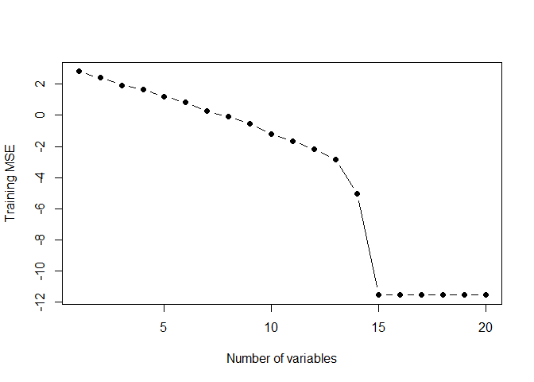
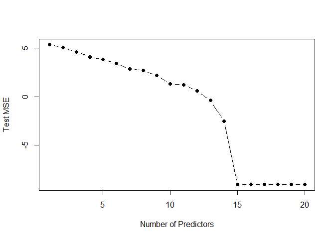
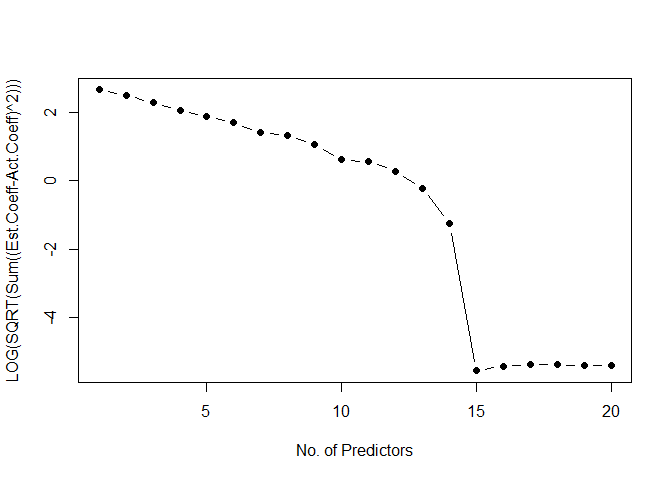

10.a
----

Generating the required dataset

    set.seed(1)

    pred.names = c("x1","x2","x3","x4","x5","x6","x7","x8","x9","x10","x11","x12","x13","x14","x15","x16","x17","x18","x19","x20")
    pred.matrix = matrix(data = rnorm(20000), nrow = 1000, ncol = 20, dimnames = list(NULL, pred.names))
    err = 10^(-2)*rnorm(1000)

    beta = c(10^0.2*rnorm(1),
             10^.4*rnorm(1),
             10^0.6*rnorm(1),
             10^0.8*rnorm(1),
             10*rnorm(1),
             0, 
             10^0.25*rnorm(1),
             10^0.5*rnorm(1),
             10^0.75*rnorm(1),
             10*rnorm(1),
             0,
             10^0.33*rnorm(1),
             10^0.66*rnorm(1),
             10*rnorm(1),
             0,
             10^0.5*rnorm(1),
             10*rnorm(1),
             0,
             10^0.1*rnorm(1),
             0)

    names(beta) = pred.names

    y = pred.matrix%*%beta + err

    df = as.data.frame(pred.matrix)
    df$y = y

10.b
----

Splitting the data into training set and test set in the ration of
100:900

    train = sample(seq(1000), 100)
    test = -(train)

10.c
----

    regfit.train = regsubsets(y~., data = df[train,], nvmax = 20)
    regfit.train.summary = summary(regfit.train)

    #The RSS associated with subset sizes have a large spread and hence instead of plotting MSE we are plotting log(MSE)
    plot(log(regfit.train.summary$rss/1000), xlab = "Number of variables", ylab = "Training MSE", pch = 19, type = "b")

### 10.d

    test.matrix = model.matrix(y~., data = df[test,])
    val.mse = rep(NA, 20)

    for(i in 1:20){
      coefi = coef(regfit.train, id=i)
      pred = test.matrix[,names(coefi)]%*%coefi
      val.mse[i] = mean((pred - df$y[test])^2)
    }
    plot(1:20, log(val.mse), xlab = "Number of Predictors", ylab = "Test MSE", pch = 19, type = "b")

    which.min(log(val.mse))

    ## [1] 15

### 10.e

The test MSE takes on its lowest value for set with 15 predictors. This
agrees with the model where 5 predictors have been assigned a
coefficient = 0

### 10.f

    #List of coefficeints, excluding the intercept, for the best subset regression
    coef.best.subset = coefficients(regfit.train, id=which.min(val.mse))[-1]
    coef.best.subset

    ##         x1         x2         x3         x4         x5         x7 
    ##  0.9528427 -6.9507535  0.7225517 14.2710334  7.1220158  2.0580803 
    ##         x8         x9        x10        x12        x13        x14 
    ##  0.7939251 -6.1828093  3.7231615 -3.8143401  2.2819072 -3.7975828 
    ##        x16        x17        x19 
    ##  0.8821011  0.2578985  1.6910038

    print("*************")

    ## [1] "*************"

    beta

    ##         x1         x2         x3         x4         x5         x6 
    ##  0.9526659 -6.9506806  0.7226563 14.2715431  7.1197130  0.0000000 
    ##         x7         x8         x9        x10        x11        x12 
    ##  2.0579543  0.7936408 -6.1809244  3.7242349  0.0000000 -3.8148727 
    ##        x13        x14        x15        x16        x17        x18 
    ##  2.2820751 -3.7971579  0.0000000  0.8821284  0.2597137  0.0000000 
    ##        x19        x20 
    ##  1.6901381  0.0000000

The best subset regression returned almost the same coefficients as set
in the model definition. It certainly identified the 5 the variables
with zero coefficeints.

### 10.g

    coef.regsubsets = matrix(data=rep(0,400), nrow = 20, ncol = 20, dimnames = list(pred.names,NULL))

    #For each subset we identify the coefficients that were set and then extract those coefficeints into a larger matrix that will have coefficients for all subsets against their respective predictor
    for (j in 1:20){
      coef.regsubset.j = coefficients(regfit.train, id=j)[-1]
      temp = rep(FALSE, 20)
      temp = ifelse(row.names(coef.regsubsets)%in%names(coef.regsubset.j), TRUE, FALSE)
      coef.regsubsets[temp==TRUE,j] = coef.regsubset.j
    }

    RMSE.coeff.estimates = (coef.regsubsets-beta)^2
    RMSE.coeff.estimates.sum = sqrt(colSums(RMSE.coeff.estimates))
    plot(log(RMSE.coeff.estimates.sum), type = "b", pch = 19, xlab = "No. of Predictors", ylab = "LOG(SQRT(Sum((Est.Coeff-Act.Coeff)^2)))")

The general shape of the plot above is similar to the Test MSE plot.
However the low point is much more clear in this plot than the Test MSE
plot.
