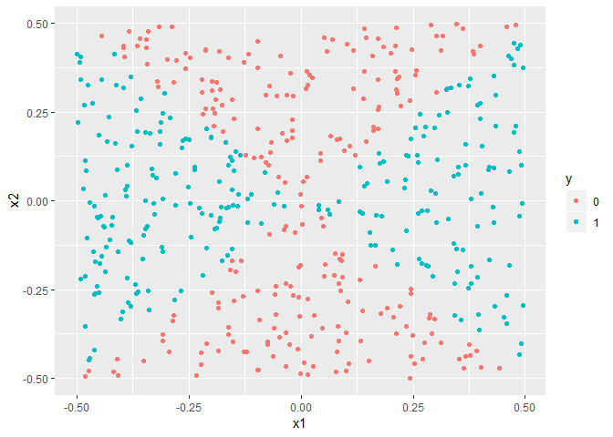
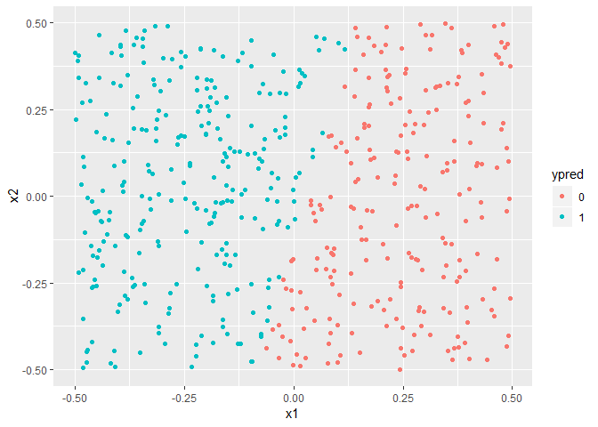
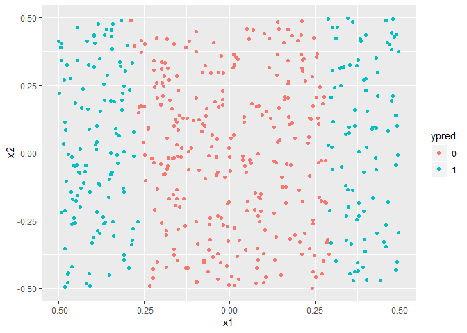
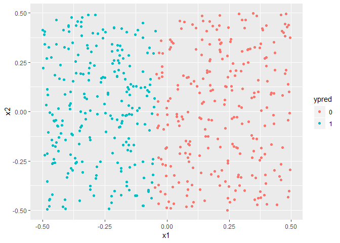
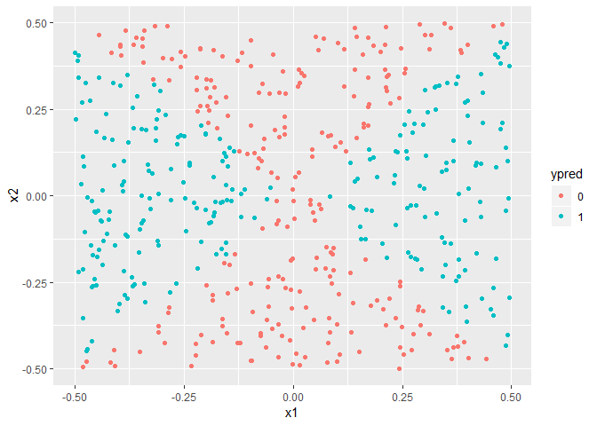
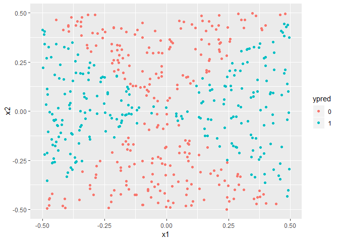

    knitr::opts_chunk$set(echo = TRUE)
    library(e1071)
    library(dplyr)
    library(ggplot2)

### 5.a

    set.seed(1970)
    x1 = runif(500)-0.5
    x2 = runif(500)-0.5
    y = 1*(x1^2-x2^2 > 0)
    dat = data.frame(x1=x1, x2=x2, y=as.factor(y))

### 5.b

    dat %>% ggplot(aes(x1, x2))+ geom_point(aes(color = y))

### 5.c

    fit = glm(y~., data = dat, family = "binomial")

### 5.d

    probs = predict(fit, dat, type = "response")
    ypred = ifelse(probs<0.5, 0, 1) %>% as.factor()
    dat %>% ggplot(aes(x1,x2))+ geom_point(aes(color = ypred))

    print(paste("The prediction error for logistic regression using linear functions of the predictors = ", mean(as.numeric(ypred) != as.numeric(dat$y))))

    ## [1] "The prediction error for logistic regression using linear functions of the predictors =  0.482"

### 5.e

    fit = glm(y~x1*x2+I(x1^2), data = dat, family = "binomial")

### 5.f

    probs = predict(fit, dat, type = "response")
    ypred = ifelse(probs<0.5, 0, 1) %>% as.factor()
    dat %>% ggplot(aes(x1, x2))+ geom_point(aes(col = ypred))

    print(paste("The prediction error for logistic regression using non-linear functions of the predictors = ", mean(as.numeric(ypred) != as.numeric(dat$y))))

    ## [1] "The prediction error for logistic regression using non-linear functions of the predictors =  0.272"

### 5.g

    tune.out = tune(svm, y~., data = dat, kernel = "linear", 
                    ranges = list(cost = c(0.001, 0.01, 0.1, 1, 10)))
    ypred = tune.out$best.model$fitted %>% as.factor()
    dat %>% ggplot(aes(x1,x2))+ geom_point(aes(color = ypred))

    print(paste("The lowest prediction error for a support vector classifier = ", mean(as.numeric(ypred) != as.numeric(dat$y))))

    ## [1] "The lowest prediction error for a support vector classifier =  0.424"

### 5.h

    tune.out = tune(svm, y~., data = dat, kernel = "radial", 
                   ranges = list(cost = c(0.001, 0.01, 0.1, 1, 10), 
                                 gamma = c(0.1, 0.33, 0.66, 1)))
    ypred = tune.out$best.model$fitted %>% as.factor()
    dat %>% ggplot(aes(x1,x2))+ geom_point(aes(color = ypred))

    print(paste("The lowest prediction error for a SVM with radial kernel = ", mean(as.numeric(ypred) != as.numeric(dat$y))))

    ## [1] "The lowest prediction error for a SVM with radial kernel =  0.02"

    tune.out = tune(svm, y~., data = dat, kernel = "polynomial", 
                   ranges = list(cost = c(0.001, 0.01, 0.1, 1, 10), 
                                 gamma = c(0.1, 0.33, 0.66, 1),
                                 degree = c(2, 3, 4)))
    ypred = tune.out$best.model$fitted %>% as.factor()
    dat %>% ggplot(aes(x1,x2))+ geom_point(aes(color = ypred))

    print(paste("The lowest prediction error for a SVM with polynomial kernel = ", mean(as.numeric(ypred) != as.numeric(dat$y))))

    ## [1] "The lowest prediction error for a SVM with polynomial kernel =  0.05"

### 5.i

We use the prediction error rates to evaluate the performance of the
various models fitted.

1.  A logistical regression using linear functions of predictors does as
    well (rather as poorly) as a support vector classifier.
2.  Using non-linear functions of the predictors in fitting a logistical
    regression model dramatically improves the quality of the fit. Here
    we have used one set of non-linear functions and we believe that
    quality of this fit may be improved through trial and error by using
    different non-linear functions of the predictors.
3.  SVMs with non-linear kernels deliver models that almost exactly fit
    the observation data. Unlike logistical regression using non-linear
    functions, finding an optimal SVM with non-linear kernels is
    relatively easy as it involves iterating over a small set of
    parameters (cost, gamma, degree) rather than over a series of
    non-linear functions of the predictors.
4.  On the flip side, with the logistic regression we are able to better
    explain how the predictor variables affect the response variable,
    something we can't do with the SVMs.
