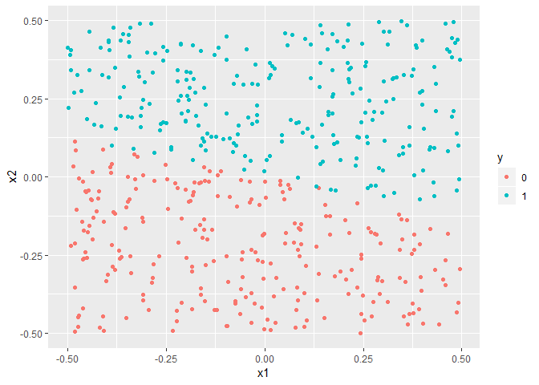

    knitr::opts_chunk$set(echo = TRUE)
    library(e1071)
    library(dplyr)
    library(ggplot2)

### 6.a

    set.seed(1970)
    x1 = runif(500)-0.5
    x2 = runif(500)-0.5
    y = 1*(0.25*x1+x2 > 0)
    dat = data.frame(x1=x1, x2=x2, y=as.factor(y))

    dat %>% ggplot(aes(x1, x2))+ geom_point(aes(color = y))

### 6.b

    set.seed(1970)
    train = sample(nrow(dat), nrow(dat)*.75)

    cost = c(0.001, 0.01, 0.1, 1, 10, 100, 1000)

    comp.train = function(c){
      fit = tune(svm, y~., data = dat[train,], kernel = "linear", cost = c)
      misclass = c(fit$performances$error, sum(fit$best.model$fitted != dat$y[train]))
      return(misclass)
    }
    compare.table.train = sapply(cost, comp.train) %>% t()

    data.frame(cost = cost, train.cv.error = compare.table.train[,1], train.dat.misclass = compare.table.train[,2]) 

    ##    cost train.cv.error train.dat.misclass
    ## 1 1e-03    0.490327169                155
    ## 2 1e-02    0.029231863                 10
    ## 3 1e-01    0.013229018                  4
    ## 4 1e+00    0.008108108                  1
    ## 5 1e+01    0.005334282                  2
    ## 6 1e+02    0.005334282                  1
    ## 7 1e+03    0.002631579                  0

As the cost goes up, both the number of training observations
misclassified and the training cross-validation error goes down. The
lowest value for cross-validation error and number of misclassified
training observations is achieved for cost=1000

### 6.c

    comp.test = function(c){
      fit = svm(y~., data = dat[train,], kernel = "linear", cost = c)
      pred = predict(fit, dat[-train,])
      misclass = sum(pred != dat$y[-train])
      return(misclass)
    }
    compare.table.test = sapply(cost, comp.test)

    data.frame(cost = cost, test.dat.misclass = compare.table.test)

    ##    cost test.dat.misclass
    ## 1 1e-03                53
    ## 2 1e-02                 0
    ## 3 1e-01                 2
    ## 4 1e+00                 3
    ## 5 1e+01                 2
    ## 6 1e+02                 2
    ## 7 1e+03                 1

The lowest number of missclassified test data observations is achieved
at cost=0.01. At this value of cost, the training data shows a
significant number of observations misclassified.

### 6.d

As the cost goes up, the SVC closely fits the training data achieving
better cross-validation error and misclassification rates. However the
overfitted SVC can not reproduce its performance when applied to test
data. On the other hand, accepting a cost with marginally poor training
misclassification rate improves the misclassification rate for the test
observation. This is a demonstration of the statement "a support vector
classifier with a small value of cost that misclassfies a couple of
training observations may perform better on test data than one with a
huge value of cost that does not misclassify any training observations".
