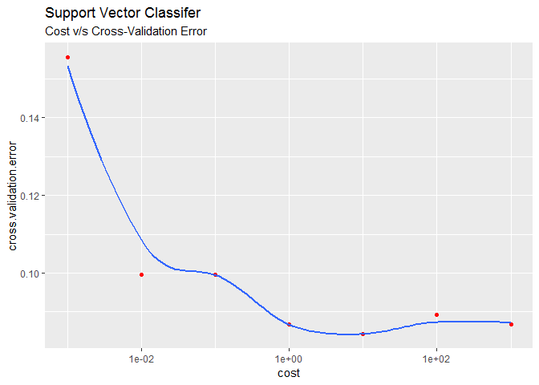
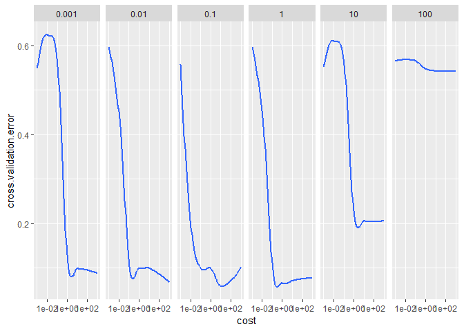
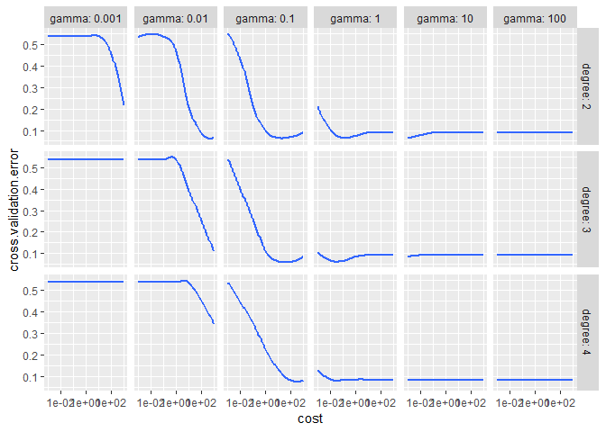

    knitr::opts_chunk$set(echo = TRUE)
    library(e1071)
    library(ISLR)
    library(dplyr)
    library(ggplot2)
    attach(Auto)

### 7.a

    Auto = Auto %>% mutate(flag = as.factor(ifelse(mpg>median(mpg), 1, 0)), origin = as.factor(origin),
                           cylinders = as.factor(cylinders), year = as.factor(year))

### 7.b

    cost = c(0.001, 0.01, 0.1, 1, 10, 100, 1000)

    set.seed(1970)
    tune.out = tune(svm, data = Auto, flag~.-mpg-name, scale = TRUE, kernel = "linear",
                    ranges = list(cost = cost))
    print("The cross validation errors for the SVC associated with different values of cost")

    ## [1] "The cross validation errors for the SVC associated with different values of cost"

    data.frame(cost = tune.out$performances$cost, cross.validation.error = tune.out$performances$error)

    ##    cost cross.validation.error
    ## 1 1e-03             0.15564103
    ## 2 1e-02             0.09948718
    ## 3 1e-01             0.09948718
    ## 4 1e+00             0.08673077
    ## 5 1e+01             0.08429487
    ## 6 1e+02             0.08923077
    ## 7 1e+03             0.08666667

    data.frame(cost = cost, cross.validation.error = tune.out$performances$error) %>% 
      ggplot(aes(cost, cross.validation.error))+geom_point(col = "Red")+ geom_smooth(se = FALSE)+
        scale_x_log10()+ ggtitle("Support Vector Classifer", subtitle = "Cost v/s Cross-Validation Error")

    ## `geom_smooth()` using method = 'loess' and formula 'y ~ x'

 As cost
increases, the quality of the fit improves, achieving its lowest
cross-validated error for cost=10, before deterioting again with
increasing cost. The graph makes this relationship clear.

### 7.c

    gamma = c(0.001, 0.01, 0.1, 1, 10, 100)

    tune.out = tune(svm, data = Auto, flag~.-mpg-name, scale = TRUE, kernel = "radial",
                    ranges = list(cost = cost, gamma = gamma))
    print("The cross validation errors for the SVM with radial kernel with different values of cost and gamma")

    ## [1] "The cross validation errors for the SVM with radial kernel with different values of cost and gamma"

    data.frame(
      cost = tune.out$performances$cost,
      gamma = tune.out$performances$gamma,
      cross.validation.error = tune.out$performances$error) %>%
      ggplot(aes(cost, cross.validation.error)) + scale_x_log10() + geom_smooth(se = FALSE) + 
      facet_grid(. ~ gamma)

    ## `geom_smooth()` using method = 'loess' and formula 'y ~ x'

    print(paste("The lowest cross validated error is obtained for cost =", tune.out$best.parameters$cost, "and gamma =",tune.out$best.parameters$gamma))

    ## [1] "The lowest cross validated error is obtained for cost = 10 and gamma = 0.1"

    degree = c(2, 3, 4)

    tune.out = tune(svm, data = Auto, flag~.-mpg-name, scale = TRUE, kernel = "polynomial",
                    ranges = list(cost = cost, gamma = gamma, degree = degree))
    print("The cross validation errors for the SVM with polynomial kernel with different values of cost, degree and gamma")

    ## [1] "The cross validation errors for the SVM with polynomial kernel with different values of cost, degree and gamma"

    data.frame(
      cost = tune.out$performances$cost,
      gamma = tune.out$performances$gamma,
      degree = tune.out$performances$degree,
      cross.validation.error = tune.out$performances$error) %>%
      ggplot(aes(cost, cross.validation.error)) + scale_x_log10() + geom_smooth(se = FALSE) +
      facet_grid(degree ~ gamma, labeller = label_both)

    ## `geom_smooth()` using method = 'loess' and formula 'y ~ x'

    print(paste("The lowest cross validated error is obtained for cost =", tune.out$best.parameters$cost, "degree =", tune.out$best.parameters$degree, "and gamma =",tune.out$best.parameters$gamma))

    ## [1] "The lowest cross validated error is obtained for cost = 10 degree = 3 and gamma = 0.1"

### 7.d

I am unable to draw the required plots because the following code throws
up an error that I am unable to diagnose

    #plot(tune.out$best.model, Auto, weight~displacement)
