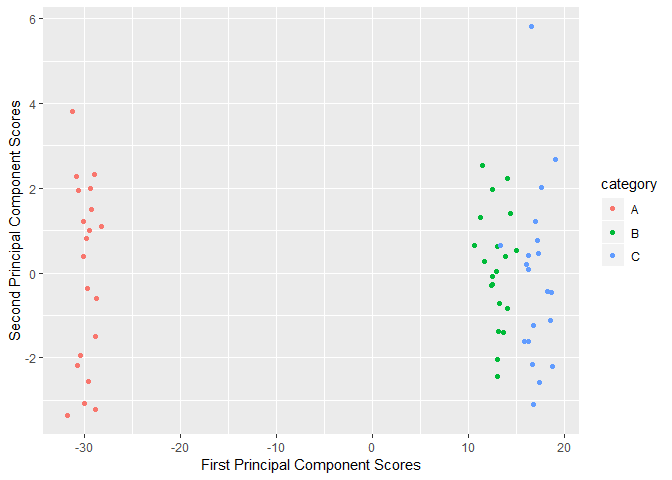

    knitr::opts_chunk$set(echo = TRUE)
    library(ggplot2)
    library(dplyr)

### 10.a

    set.seed(1970)
    dat = matrix(rnorm(60*50), nrow = 60, ncol = 50)
    dat[1:20,] = dat[1:20,]-5
    dat[21:40,] = dat[21:40,]+1
    dat[41:60,] = dat[41:60,]+1.6

### 10.b

    pr.out = prcomp(dat)

    data.frame(PC1 = pr.out$x[,1], PC2 = pr.out$x[,2], category = c(rep("A",20), rep("B", 20), rep("C", 20))) %>% ggplot(aes(PC1, PC2, col = category))+ geom_point()+ 
      xlab("First Principal Component Scores")+ ylab("Second Principal Component Scores")

### 10.c

    dat.clab = c(rep("A",20), rep("B", 20), rep("C", 20))
    km.out = kmeans(dat, centers = 3, nstart = 20)
    table(K.Means.Cluster = km.out$cluster, True.Class.Labels = dat.clab)

    ##                True.Class.Labels
    ## K.Means.Cluster  A  B  C
    ##               1 20  0  0
    ##               2  0 18  1
    ##               3  0  2 19

    km.out$tot.withinss; km.out$betweenss; km.out$totss

    ## [1] 2864.901

    ## [1] 26972.48

    ## [1] 29837.38

The clusters obtained by K-means are almost the same as the true class
labels. 3 observations are incorrectly classified by K-means. The
incorrectly classified observations are from classes B and C which are
quite close to one another.

### 10.d

    km.out = kmeans(dat, centers = 2, nstart = 20)
    table(K.Means.Cluster = km.out$cluster, True.Class.Labels = dat.clab)

    ##                True.Class.Labels
    ## K.Means.Cluster  A  B  C
    ##               1  0 20 20
    ##               2 20  0  0

    km.out$tot.withinss; km.out$betweenss; km.out$totss

    ## [1] 3103.037

    ## [1] 26734.34

    ## [1] 29837.38

When asked to classify into 2 clusters, the observations from classes B
and C are combined. As a result the total within cluster sum of squares
increases as compared to the total within cluster sum of squares when k
= 3.The total sum of squares however remains the same.

### 10.e

    km.out = kmeans(dat, centers = 4, nstart = 20)
    table(K.Means.Cluster = km.out$cluster, True.Class.Labels = dat.clab)

    ##                True.Class.Labels
    ## K.Means.Cluster  A  B  C
    ##               1  0 12  1
    ##               2  0  0 14
    ##               3  0  8  5
    ##               4 20  0  0

    km.out$tot.withinss; km.out$betweenss; km.out$totss

    ## [1] 2744.052

    ## [1] 27093.33

    ## [1] 29837.38

When asked to classify into 4 clusters, the observations from class A
remain together but observations from classes B and C are classified
across different clusters. As a result the total within cluster sum of
squares reduces as compared to the case where k = 3 but the total
between cluster sum of squares increases.

### 10.f

    km.out = kmeans(matrix(data = c(pr.out$x[,1], pr.out$x[,2]), ncol = 2), centers = 3, nstart = 20)
    table(K.Means.Cluster = km.out$cluster, True.Class.Labels = dat.clab)

    ##                True.Class.Labels
    ## K.Means.Cluster  A  B  C
    ##               1  0 20  1
    ##               2 20  0  0
    ##               3  0  0 19

Applying K-means to the first principal component score vectors give a
clustering comparable to K-means clustering on the original data. This
implies that the first two principal component score vectors contain
almost all the "information" in the original data.

The fact that a 60x2 matrix contains almost all the "information" in the
original 60x50 matrix makes it computationally inexpensive and therefore
desirable to work with few "larger" principal component score vectors.

### 10.g

    km.out = kmeans(scale(dat), centers = 3, nstart = 20)
    table(K.Means.Cluster = km.out$cluster, True.Class.Labels = dat.clab)

    ##                True.Class.Labels
    ## K.Means.Cluster  A  B  C
    ##               1  0  2 19
    ##               2 20  0  0
    ##               3  0 18  1

    km.out$tot.withinss; km.out$betweenss; km.out$totss

    ## [1] 284.2483

    ## [1] 2665.752

    ## [1] 2950

Using scaled data does not improve the results obtained from K-means
clustering. This could be because the simulated data is very clearly
from three different classes.
