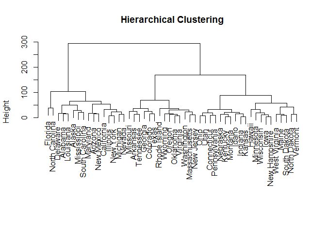
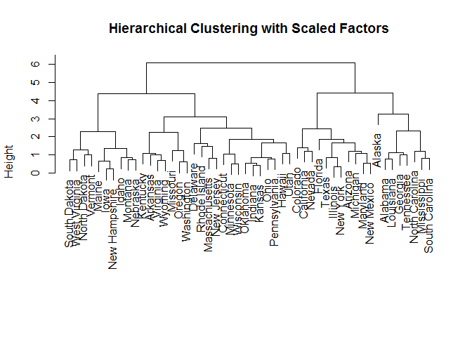

    knitr::opts_chunk$set(echo = TRUE)

### 9.a

    hc.out = hclust(dist(USArrests))

### 9.b

    hc.clusters = cutree(hc.out, k = 3)
    states = row.names(USArrests)
    for (i in 1:3){
      print(paste("The states in cluster", i, "are", sep = " "))
      print(states[hc.clusters == i])
    }

    ## [1] "The states in cluster 1 are"
    ##  [1] "Alabama"        "Alaska"         "Arizona"        "California"    
    ##  [5] "Delaware"       "Florida"        "Illinois"       "Louisiana"     
    ##  [9] "Maryland"       "Michigan"       "Mississippi"    "Nevada"        
    ## [13] "New Mexico"     "New York"       "North Carolina" "South Carolina"
    ## [1] "The states in cluster 2 are"
    ##  [1] "Arkansas"      "Colorado"      "Georgia"       "Massachusetts"
    ##  [5] "Missouri"      "New Jersey"    "Oklahoma"      "Oregon"       
    ##  [9] "Rhode Island"  "Tennessee"     "Texas"         "Virginia"     
    ## [13] "Washington"    "Wyoming"      
    ## [1] "The states in cluster 3 are"
    ##  [1] "Connecticut"   "Hawaii"        "Idaho"         "Indiana"      
    ##  [5] "Iowa"          "Kansas"        "Kentucky"      "Maine"        
    ##  [9] "Minnesota"     "Montana"       "Nebraska"      "New Hampshire"
    ## [13] "North Dakota"  "Ohio"          "Pennsylvania"  "South Dakota" 
    ## [17] "Utah"          "Vermont"       "West Virginia" "Wisconsin"

    plot(hc.out, main = "Hierarchical Clustering", xlab = "", sub = "")

    table(hc.clusters)

    ## hc.clusters
    ##  1  2  3 
    ## 16 14 20

### 9.c

    hc.out.scaled = hclust(dist(scale(USArrests)))
    hc.clusters.scaled = cutree(hc.out.scaled, k=3)
    for (i in 1:3){
      print(paste("The states in cluster", i, "are", sep = " "))
      print(states[hc.clusters.scaled == i])
    }

    ## [1] "The states in cluster 1 are"
    ## [1] "Alabama"        "Alaska"         "Georgia"        "Louisiana"     
    ## [5] "Mississippi"    "North Carolina" "South Carolina" "Tennessee"     
    ## [1] "The states in cluster 2 are"
    ##  [1] "Arizona"    "California" "Colorado"   "Florida"    "Illinois"  
    ##  [6] "Maryland"   "Michigan"   "Nevada"     "New Mexico" "New York"  
    ## [11] "Texas"     
    ## [1] "The states in cluster 3 are"
    ##  [1] "Arkansas"      "Connecticut"   "Delaware"      "Hawaii"       
    ##  [5] "Idaho"         "Indiana"       "Iowa"          "Kansas"       
    ##  [9] "Kentucky"      "Maine"         "Massachusetts" "Minnesota"    
    ## [13] "Missouri"      "Montana"       "Nebraska"      "New Hampshire"
    ## [17] "New Jersey"    "North Dakota"  "Ohio"          "Oklahoma"     
    ## [21] "Oregon"        "Pennsylvania"  "Rhode Island"  "South Dakota" 
    ## [25] "Utah"          "Vermont"       "Virginia"      "Washington"   
    ## [29] "West Virginia" "Wisconsin"     "Wyoming"

    plot(hc.out.scaled, main = "Hierarchical Clustering with Scaled Factors", xlab = "", sub = "")

    table(hc.clusters.scaled)

    ## hc.clusters.scaled
    ##  1  2  3 
    ##  8 11 31

Scaling the features significantly alters the cluster sizes and
memberships. When features are not scaled we get three clusters with
near equal sizes, where as when they are scaled we get two clusters are
near equal sizes and the third cluster with much bigger size.

### 9.d

    print("Mean values for individual features")

    ## [1] "Mean values for individual features"

    colMeans(USArrests)

    ##   Murder  Assault UrbanPop     Rape 
    ##    7.788  170.760   65.540   21.232

    print("Standard deviation for individual features")

    ## [1] "Standard deviation for individual features"

    apply(USArrests, 2, sd)

    ##    Murder   Assault  UrbanPop      Rape 
    ##  4.355510 83.337661 14.474763  9.366385

As the two tables above show the 4 features have very different means
(differing by as much as 10x) and wide variances. In absence of scaling,
the features with larger values are likely to dominate the calculation
of the Euclidean distance between 2 observations and therefore dominate
the decision whether the pair is similar. This is undesirable as we want
all the 4 features to have a fair weight in the decision of whether a
pair is similar. Lack of scaling is likely to create clusters that may
misguide the decision.
