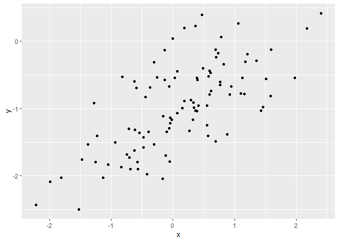
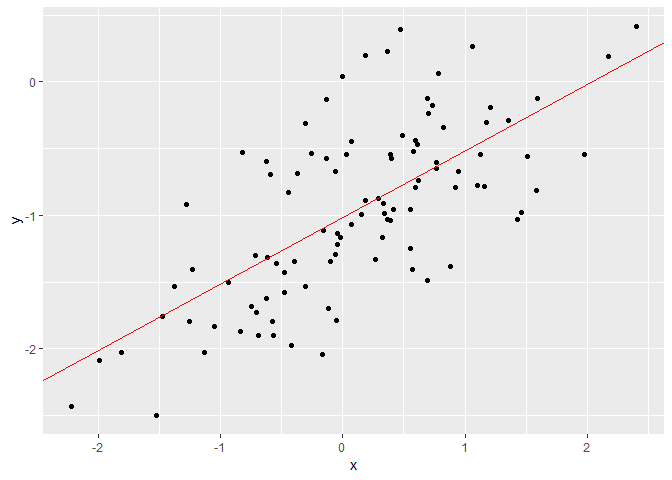
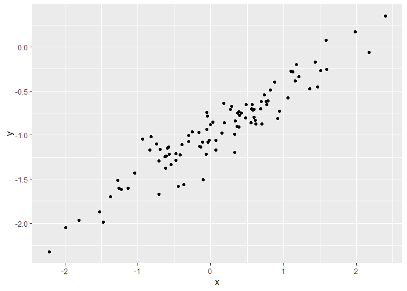
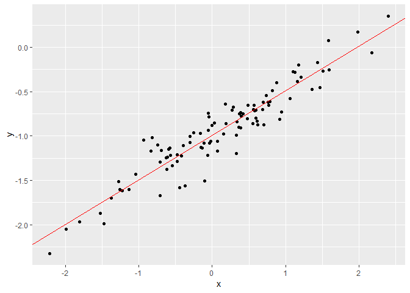
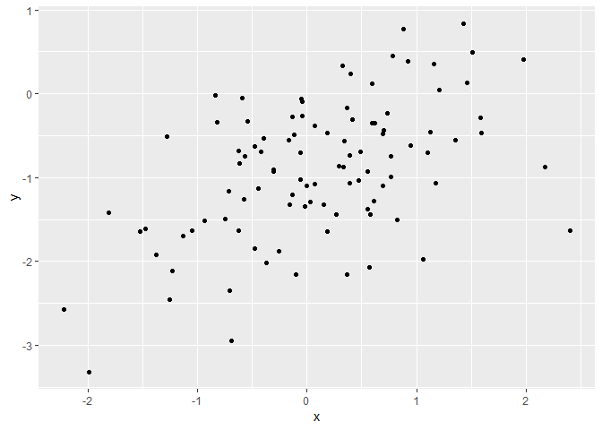
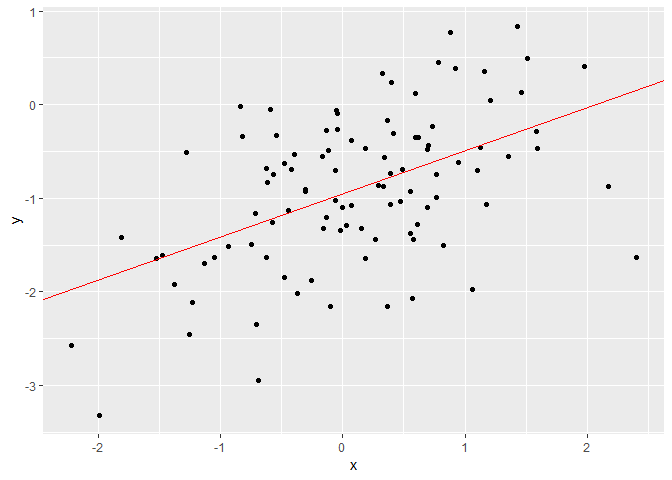

Including the necessary libraries

    library(ISLR)
    library(car)
    library(tidyverse)

Problem 13
----------

13.a
====

    set.seed(1)
    x = rnorm(100)

13.b
====

    eps= rnorm(100,0,sqrt(0.25))

13.c
====

    y = -1+0.5*x+eps

The length of vector y is 100 and the values of beta\_0 and beta\_1 in
this linear model are respectively -1 and 0.5.

13.d
====

    data.frame(y=y, x=x) %>% ggplot(aes(x,y))+ geom_point()

The scatter plot seems to indicate that y increases monotonically with
x, something we expect because of the model definition. However the
noise term (eps) means that y's are not on a straight line but scattered
about.

13.e
====

    linear_fit_13e = lm(y~x)
    summary_13e = summary(linear_fit_13e)
    beta_hat_0_13e = summary_13e$coefficients[1]
    beta_hat_1_13e = summary_13e$coefficients[2]

The beta\_hat\_0 value of

    ## [1] -1.02

is very close to beta\_0 = -1 and similarly the beta\_hat\_1 value of

    ## [1] 0.499

is very close to beta\_1 = 0.5. The differences are attributable to the
noise term eps.

13.f
====

    data.frame(y=y, x=x) %>% ggplot(aes(x,y))+ geom_point()+ geom_abline(slope=beta_hat_1_13e, intercept=beta_hat_0_13e, col="RED", show.legend=TRUE)

13.g
====

    linear_fit_13g = lm(y~x+I(x^2))
    summary_13g = summary(linear_fit_13g)
    R_sq_13g = summary_13g$r.squared

    R_sq_13e = summary_13e$r.squared

The R-squared fit for fit with only linear term

    ## [1] 0.4673515

The R-squared fit for fit with linear and quadratic term

    ## [1] 0.4779446

The R-squared value with the quadratic term is slightly better than the
R-squared value with only a linear term. This is a classic example of
"over-fitting". The noise term eps means that y does not have a strict
linear relationship with x and therefore the quadratic term helps create
a more "wiggly" line that better fits the training data. However it is
fully expected that with test data, the linear-term-only model would
perform much better.

13.h
====

    eps_less = rnorm(100,0,sqrt(0.025))
    y = -1+0.5*x+eps_less

    data.frame(y=y, x=x) %>% ggplot(aes(x,y))+ geom_point()

    linear_fit_13h = lm(y~x)
    summary_13h = summary(linear_fit_13h)
    beta_hat_0_13h = summary_13h$coefficients[1]
    beta_hat_1_13h = summary_13h$coefficients[2]
    R_sq_13h = summary_13h$r.squared

    data.frame(y=y, x=x) %>% ggplot(aes(x,y))+ geom_point()+ geom_abline(slope=beta_hat_1_13h, intercept=beta_hat_0_13h, col="Red", show.legend=TRUE)

The summary of the linear fit with "lower" noise is below:

    ## 
    ## Call:
    ## lm(formula = y ~ x)
    ## 
    ## Residuals:
    ##      Min       1Q   Median       3Q      Max 
    ## -0.46076 -0.07626 -0.00717  0.10265  0.41767 
    ## 
    ## Coefficients:
    ##             Estimate Std. Error t value Pr(>|t|)    
    ## (Intercept) -0.99567    0.01656  -60.14   <2e-16 ***
    ## x            0.50335    0.01839   27.37   <2e-16 ***
    ## ---
    ## Signif. codes:  0 '***' 0.001 '**' 0.01 '*' 0.05 '.' 0.1 ' ' 1
    ## 
    ## Residual standard error: 0.1643 on 98 degrees of freedom
    ## Multiple R-squared:  0.8843, Adjusted R-squared:  0.8832 
    ## F-statistic: 749.3 on 1 and 98 DF,  p-value: < 2.2e-16

As the summary indicates the beta-hat-0 and beta-hat-1 are comparable to
those from the earlier fit, but the R-squared value has increased
significantly, indicating that this fit is much closer to the "true"
fit. This "better" fit is attributable to the lesser noise term.

    ## [1] 0.8843369

13.i
====

    eps_more = rnorm(100,0,sqrt(0.5))
    y = -1+0.5*x+eps_more

    data.frame(y=y, x=x) %>% ggplot(aes(x,y))+ geom_point()

    linear_fit_13i = lm(y~x)
    summary_13i = summary(linear_fit_13i)
    beta_hat_0_13i = summary_13i$coefficients[1]
    beta_hat_1_13i = summary_13i$coefficients[2]
    R_sq_13i = summary_13i$r.squared

    data.frame(y=y, x=x) %>% ggplot(aes(x,y))+ geom_point()+ geom_abline(slope=beta_hat_1_13i, intercept=beta_hat_0_13i, col="Red", show.legend=TRUE)

The summary of the linear fit with "higher" noise is below:

    ## 
    ## Call:
    ## lm(formula = y ~ x)
    ## 
    ## Residuals:
    ##     Min      1Q  Median      3Q     Max 
    ## -1.7793 -0.3856 -0.0267  0.4758  1.3286 
    ## 
    ## Coefficients:
    ##             Estimate Std. Error t value Pr(>|t|)    
    ## (Intercept) -0.95922    0.07091 -13.527  < 2e-16 ***
    ## x            0.46062    0.07876   5.848 6.55e-08 ***
    ## ---
    ## Signif. codes:  0 '***' 0.001 '**' 0.01 '*' 0.05 '.' 0.1 ' ' 1
    ## 
    ## Residual standard error: 0.7039 on 98 degrees of freedom
    ## Multiple R-squared:  0.2587, Adjusted R-squared:  0.2512 
    ## F-statistic:  34.2 on 1 and 98 DF,  p-value: 6.553e-08

As the summary indicates the beta-hat-0 and beta-hat-1 are again
comparable to those from the earlier two fits, but are furtheset of the
three from the coefficients of the true fit, beta-0 and beta-1, and the
fitted line has clearly lower slope. The R-squared value has decreased
significantly from the less noisy dataset, indicating that this fit is
poorer to the "true" fit. This "poor" fit is attributable to the larger
noise term. The R-squared value for the noiser fit is:

    ## [1] 0.2587148

13.j
====

The 95% confidence intervals for coefficients the three fits: original
data set, the noiser dataset and less noisy dataset are shown in order
below

    ## [1] "Original Dataset"

    ##                  2.5 %     97.5 %
    ## (Intercept) -1.1150804 -0.9226122
    ## x            0.3925794  0.6063602

    ## [1] "Noiser Dataset"

    ##                  2.5 %     97.5 %
    ## (Intercept) -1.0999424 -0.8185064
    ## x            0.3043238  0.6169242

    ## [1] "Less Noisy Dataset"

    ##                  2.5 %     97.5 %
    ## (Intercept) -1.0285258 -0.9628195
    ## x            0.4668557  0.5398379

Clearly, noisier the dataset wider are the confidence intervals for the
coefficient estimates.
