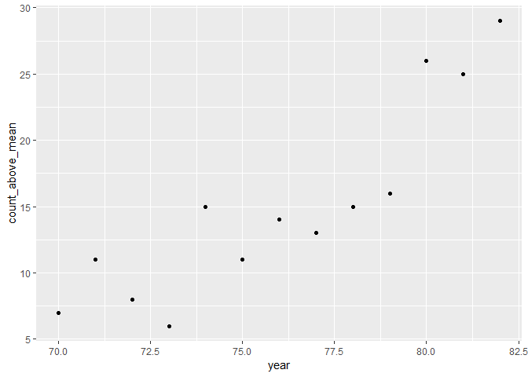
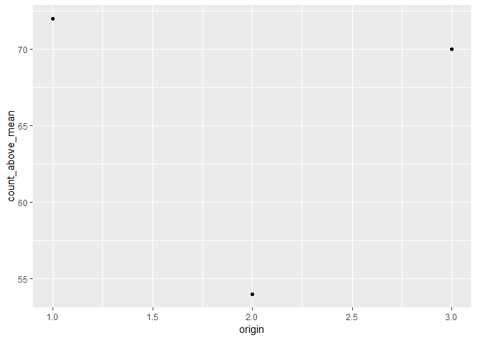
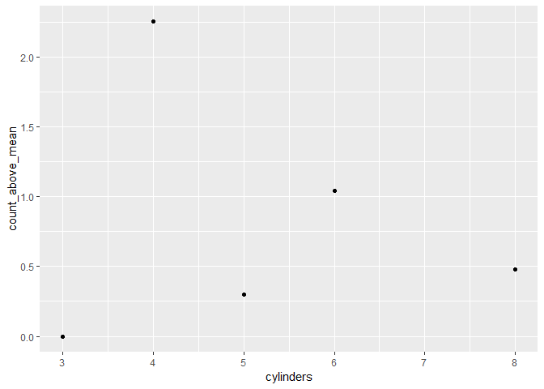
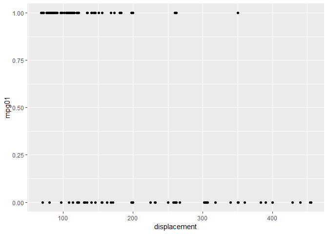
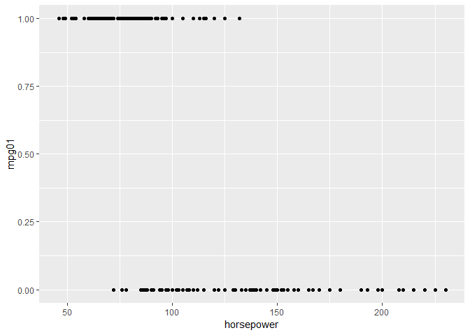
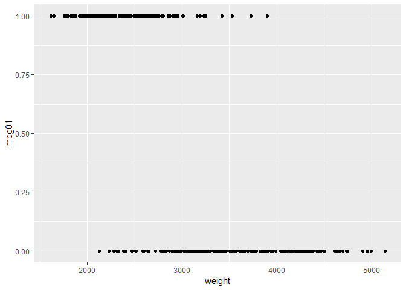
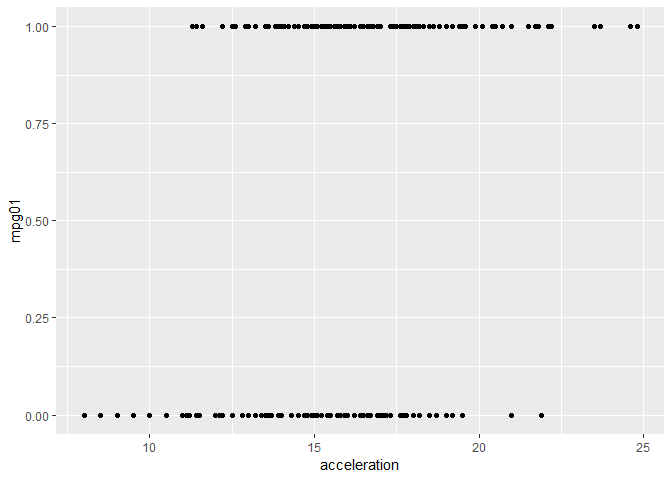
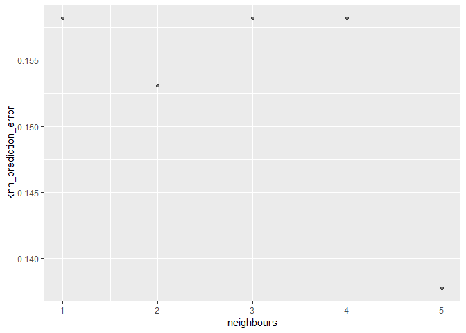

Setting up the environment

    library(ISLR)
    library(tidyverse)
    library(MASS) #for the LDA and QDA functions
    library(class) #for the KNN function
    data(Auto)

11-a
====

    median_mpg = median(Auto$mpg)
    Auto = Auto %>% mutate(mpg01=ifelse(mpg>median_mpg, 1, 0))

11-b
====

    Auto %>% group_by(year) %>% summarise(count_above_mean=sum(mpg01)) %>% ggplot(aes(year,count_above_mean))+geom_point()

    Auto %>% group_by(origin) %>% summarise(count_above_mean=sum(mpg01)) %>% ggplot(aes(origin,count_above_mean))+geom_point()

    Auto %>% group_by(cylinders) %>% summarise(count_above_mean=log10(sum(mpg01))) %>% ggplot(aes(cylinders,count_above_mean))+geom_point()

    ggplot(Auto,aes(displacement,mpg01))+geom_point()

    ggplot(Auto,aes(horsepower,mpg01))+geom_point()

    ggplot(Auto,aes(weight,mpg01))+geom_point()

    ggplot(Auto,aes(acceleration,mpg01))+geom_point()

11-c
====

    #setting training and test set sizes
    train_set_size=round(nrow(Auto)*0.50)

    #choosing training rows at random
    set.seed(1)
    train_set_rows = sample.int(nrow(Auto), train_set_size, replace=FALSE) 

    train_set = Auto %>% slice(1:train_set_size)
    test_set = Auto %>% slice(-(1:train_set_size))

11-d
====

From the visualization, mpg01 looks to be correlated to all features
except mpg (mpg01 is calculated from mpg so a correlation is not
meaningful with this feature) and name

    lda_fit = lda(mpg01~.-mpg-name, data=train_set)
    lda_pred = predict(lda_fit, newdata=test_set)
    table(Prediction=lda_pred$class, Actual=test_set$mpg01)

    ##           Actual
    ## Prediction   0   1
    ##          0  54   5
    ##          1  13 124

    test_error_lda=1-mean(lda_pred$class==test_set$mpg01)
    test_error_lda

    ## [1] 0.09183673

11-e
====

    qda_fit = qda(mpg01~.-mpg-name, data=train_set)
    qda_pred = predict(qda_fit, newdata=test_set)
    table(Prediction=qda_pred$class, Actual=test_set$mpg01)

    ##           Actual
    ## Prediction   0   1
    ##          0  61  17
    ##          1   6 112

    test_error_qda=1-mean(qda_pred$class==test_set$mpg01)
    test_error_qda

    ## [1] 0.1173469

11-f
====

    glm_fit = glm(mpg01~.-mpg, data=train_set[,-9], family=binomial)
    glm_probs = predict(glm_fit, newdata=test_set[,-9], type="response")
    glm_pred = rep(0, nrow(test_set))
    glm_pred[glm_probs>0.5]=1

    table(Prediction=glm_pred, Actual=test_set$mpg01)

    ##           Actual
    ## Prediction   0   1
    ##          0  58   8
    ##          1   9 121

    test_error_glm = 1-mean(glm_pred==test_set$mpg01)
    test_error_glm

    ## [1] 0.08673469

In the logistic regression case there was an interesting out-of-bound
situation. The values of the column "name" have completely different
"levels" in the test\_set and train\_set and this caused the prediction
to go haywire. This happens even though R is told to ignore this
particular predictor in building the model. I had to work around by
"ignoring" this column when building the model and when making the
predictions.

11-g
====

    knn_train_data = as.matrix(cbind(train_set[,2:8]))
    knn_test_data = as.matrix(cbind(test_set[,2:8]))
    knn_train_direction = train_set$mpg01

    test_error_knn_x_neigbours = function(x){
            set.seed(1)
            knn_pred=knn(knn_train_data, knn_test_data, knn_train_direction, k=x)
            test_error_knn=1-mean(knn_pred==test_set$mpg01)
            return(test_error_knn)
            }

    m = 1:5
    test_error_multi = sapply(m, test_error_knn_x_neigbours)

    test_error_multi_df = cbind.data.frame(neighbours=m, knn_prediction_error=test_error_multi)

    test_error_multi_df %>% ggplot(aes(neighbours, knn_prediction_error))+ geom_point(alpha=0.5, colour="black")

From the graph it is clear that the KNN prediction error is lowest when
we consider 5 nearest neighbours.
