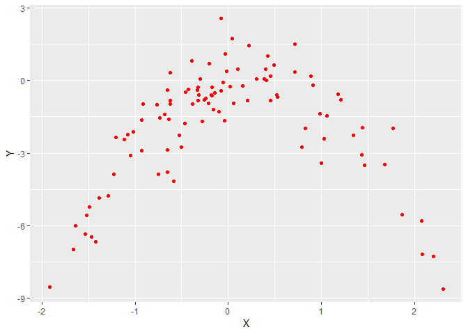

8.a
---

    set.seed(1)
    y=rnorm(100)
    x=rnorm(100)
    y=x-2*x^2+rnorm(100)

In the example above n=100 and p=2

8.b
---

    data.frame(X=x, Y=y) %>% ggplot(aes(X,Y))+geom_point(colour="Red")

The distribution looks like an inverted parabola, centred around 0 and
values ranging from {-2,2}

8.c
---

    dat = data.frame(X=x, Y=y)

    cv.error = function(seed,power){
      set.seed(seed)
      glm.fit = glm(Y~poly(X,power), data=dat)
      cv.err = cv.glm(dat, glm.fit)
      return(cv.err$delta[1])
    }

    cv.error.8c = mapply(cv.error, seed=100, power=1:4, SIMPLIFY=TRUE)

    data.frame(Power.of.X=1:4, LOOCV.MSE=cv.error.8c)

    ##   Power.of.X LOOCV.MSE
    ## 1          1  5.890979
    ## 2          2  1.086596
    ## 3          3  1.102585
    ## 4          4  1.114772

8.d
---

    cv.error.8d = mapply(cv.error, seed=10, power=1:4, SIMPLIFY=TRUE)

    data.frame(Power.of.X=1:4, LOOCV.MSE=cv.error.8d)

    ##   Power.of.X LOOCV.MSE
    ## 1          1  5.890979
    ## 2          2  1.086596
    ## 3          3  1.102585
    ## 4          4  1.114772

The results for 8-d are the same as 8-c. This is explainable as both 8-c
and 8-d use the LOOCV approach to determine the test error and therefore
perform the exact same procedure on the entire data set. Setting
different seeds has not impact as in both cases the iterations include
the exact same sets of training data and test data.

8.e
---

The model that uses both linear and quadratic values of X has the lowest
LOOCV error. This is to be expected as the true model uses the same
predictors. Including increasingly higher powers of X does not
meaningfully improve the LOOCV error (actually, marginally increases the
LOOCV error) as it starts to suffer from over fitting.

8.f
---

    coeff.p.values = function(degree){
      p.values = dat %>% glm(Y~poly(X,degree),data=.) %>% summary() %>% .$coefficients %>% .[,4]
      return(p.values)
    }

    coeff.p.values.8f = sapply(1:4,coeff.p.values)
    coeff.p.values.8f

    ## [[1]]
    ##     (Intercept) poly(X, degree) 
    ##    9.181461e-12    3.292002e-01 
    ## 
    ## [[2]]
    ##      (Intercept) poly(X, degree)1 poly(X, degree)2 
    ##     3.804657e-32     2.711854e-02     7.333860e-37 
    ## 
    ## [[3]]
    ##      (Intercept) poly(X, degree)1 poly(X, degree)2 poly(X, degree)3 
    ##     7.610579e-32     2.785714e-02     1.636959e-36     7.694742e-01 
    ## 
    ## [[4]]
    ##      (Intercept) poly(X, degree)1 poly(X, degree)2 poly(X, degree)3 
    ##     1.444977e-31     2.850549e-02     3.457023e-36     7.703881e-01 
    ## poly(X, degree)4 
    ##     6.372907e-01

The results do indeed agree with 8.c above. The p-values for the third
and fourth order terms of X are high and therefore indicate that these
terms are not good predictors of the value of Y
