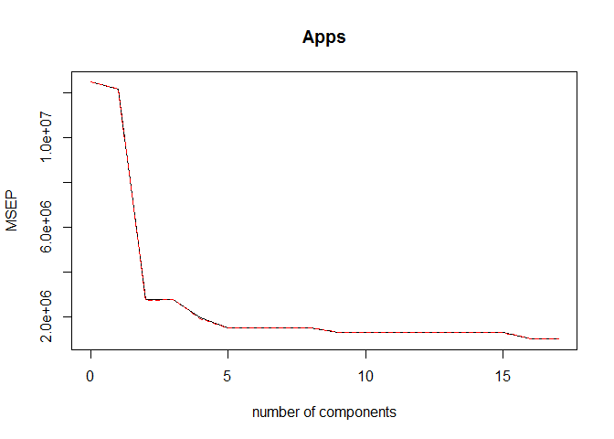
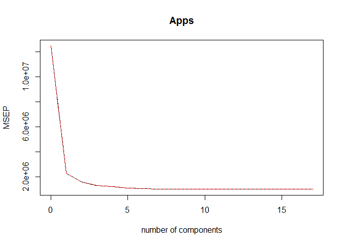

9.a
---

Splitting the data into a training set and a test set in the ratio of
75:25

    set.seed(1)
    train = sample(c(TRUE, FALSE), nrow(College), replace = TRUE, prob = c(0.75,0.25))
    test = !(train)

    #Total squared error if the response variable of all test observations were predicted to have the average value of the response variable for all training observations.

    TSS.test = sum((mean(College$Apps[train])-College$Apps[test])^2)

9.b
---

Least square regression model

    lm.fit = lm(Apps~., data = College, subset = train)
    pred.lm.fit = predict(lm.fit, newdata = College[test,], interval = "prediction", type = "response")
    RSS.lm.fit = sum((pred.lm.fit-College$Apps[test])^2)
    R2.lm.fit = 1-(RSS.lm.fit/TSS.test)
    R2.lm.fit

    ## [1] 0.4143348

9.c
---

    x.matrix = model.matrix(Apps~., data = College)[,-1] #the [,-1] gets rid of the                                                          intercept term
    y = College$Apps

    set.seed(11)
    ridge.fit = glmnet(x.matrix[train,], y[train], alpha = 0)
    cv.ridge.fit = cv.glmnet(x.matrix[train,], y[train], alpha = 0)
    best.lambda.ridge = cv.ridge.fit$lambda.min

    pred.ridge.fit = predict(ridge.fit, newx = x.matrix[test,], s = best.lambda.ridge)
    RSS.ridge.fit = sum((pred.ridge.fit-y[test])^2)
    R2.ridge.fit = 1-(RSS.ridge.fit/TSS.test)
    R2.ridge.fit

    ## [1] 0.8369328

### 9.d

    set.seed(21)
    lasso.fit = glmnet(x.matrix[train,], y[train], alpha = 1)
    cv.lasso.fit = cv.glmnet(x.matrix[train,], y[train], alpha =1)
    best.lambda.lasso = cv.lasso.fit$lambda.min

    pred.lasso.fit = predict(lasso.fit, newx = x.matrix[test,], s = best.lambda.lasso)
    RSS.lasso.fit = sum((pred.lasso.fit-y[test])^2)
    R2.lasso.fit = 1-(RSS.lasso.fit/TSS.test)
    R2.lasso.fit

    ## [1] 0.9081297

### 9.e

    set.seed(31)
    pcr.fit = pcr(Apps~., data = College, subset = train, scale = TRUE, validation = "CV")
    validationplot(pcr.fit, val.type = "MSEP")

    #From the graph I am inferring that the lowest CV error occurs for M=5, after which it starts to flatten out. This is the value of M I will use for prediction.
    pred.pcr.fit = predict(pcr.fit, newdata = College[test,], ncomp = 5)
    RSS.pcr.fit = sum((pred.pcr.fit-y[test])^2)
    R2.pcr.fit = 1-(RSS.pcr.fit/TSS.test)
    R2.pcr.fit

    ## [1] 0.7686573

### 9.f

    set.seed(41)
    pls.fit = plsr(Apps~., data = College, subset = train, scale = TRUE, validation = "CV")
    validationplot(pls.fit, val.type = "MSEP")

    #From the graph I am inferring that the lowest CV error occurs for M=3, after which it starts to flatten out. This is the value of M I will use for prediction.
    pred.pls.fit = predict(pls.fit, newdata = College[test,], ncomp = 3)
    RSS.pls.fit = sum((pred.pls.fit-y[test])^2)
    R2.pls.fit = 1-(RSS.pls.fit/TSS.test)
    R2.pls.fit

    ## [1] 0.8038435

### 9.g

The table below presents the summary of the performance of the 5 models
using R^2 as a measure of comparison. The Lasso model outperforms all
the other models significantly, though the LSE model is greatly improved
upon by all the 4 models.

    matrix(data = c("Least Square", "Ridge", "Lasso", "Principal Component", "Partial Least Squares", R2.lm.fit, R2.ridge.fit, R2.lasso.fit, R2.pcr.fit, R2.pls.fit), ncol = 2, dimnames = list(NULL, c("Model Type", "R2")))

    ##      Model Type              R2                 
    ## [1,] "Least Square"          "0.414334813733562"
    ## [2,] "Ridge"                 "0.836932809769334"
    ## [3,] "Lasso"                 "0.908129712922164"
    ## [4,] "Principal Component"   "0.768657338707952"
    ## [5,] "Partial Least Squares" "0.803843464064229"

The table below presents the lasso regression coeffiecients for the
predictor variables, for the "best" value of lambda and compares them
with the least square regression coeffiecients.

For an apples-to-apples comparison we have used only the training set in
calculating these coeffiecients. In this case while Lasso does
significantly outperform Least Square, it improves the interpretability
of the model only marginally, as Lasso is able to drive the coefficients
of only 3 variables (Enroll, Books and F.Undergrad) to zero.

    #Deriving the coefficients of best lambda
    lasso.coef = predict(lasso.fit, type = "coefficients", s = best.lambda.lasso)[1:18]

    cbind(Predictor = c("Intercept",names(College[-2])), Lasso_Coeffs = lasso.coef, Least_Square_Coeffs = as.numeric(lm.fit$coefficients))

    ##       Predictor     Lasso_Coeffs          Least_Square_Coeffs   
    ##  [1,] "Intercept"   "-630.01750572308"    "-574.992274612372"   
    ##  [2,] "Private"     "-561.421704955967"   "-581.386618078179"   
    ##  [3,] "Accept"      "1.22714305089371"    "1.27101518233394"    
    ##  [4,] "Enroll"      "0"                   "-0.236419889009567"  
    ##  [5,] "Top10perc"   "37.4173461361619"    "44.3784715685689"    
    ##  [6,] "Top25perc"   "-8.15571244553326"   "-13.3107562149717"   
    ##  [7,] "F.Undergrad" "0.0467751924123242"  "0.0716002797103089"  
    ##  [8,] "P.Undergrad" "0"                   "-0.00197075798273658"
    ##  [9,] "Outstate"    "-0.0221442466153092" "-0.0332712598121555" 
    ## [10,] "Room.Board"  "0.119125427888357"   "0.135543566069072"   
    ## [11,] "Books"       "0"                   "0.0240624433680187"  
    ## [12,] "Personal"    "0.010185510950554"   "0.0213558540328785"  
    ## [13,] "PhD"         "-6.83159370661475"   "-8.26600462789905"   
    ## [14,] "Terminal"    "-0.648150141791539"  "-0.721645466392807"  
    ## [15,] "S.F.Ratio"   "3.15049505906859"    "8.13364699970765"    
    ## [16,] "perc.alumni" "-6.85552016066088"   "-6.66829247779745"   
    ## [17,] "Expend"      "0.0689930002914038"  "0.0716238350723308"  
    ## [18,] "Grad.Rate"   "7.58483717973554"    "8.95364862787655"
