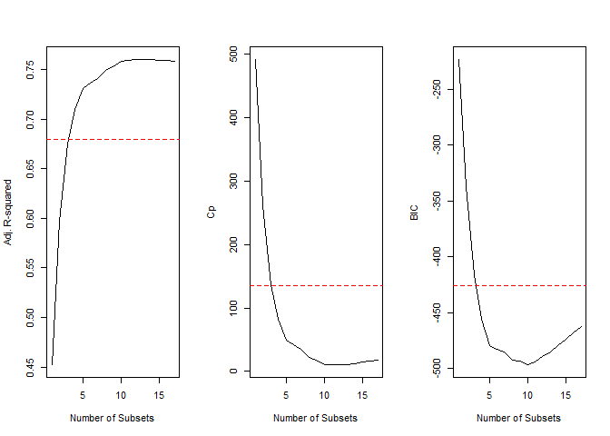
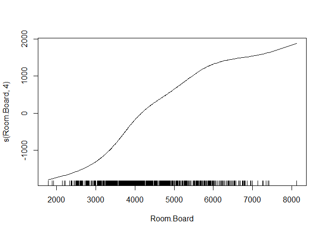
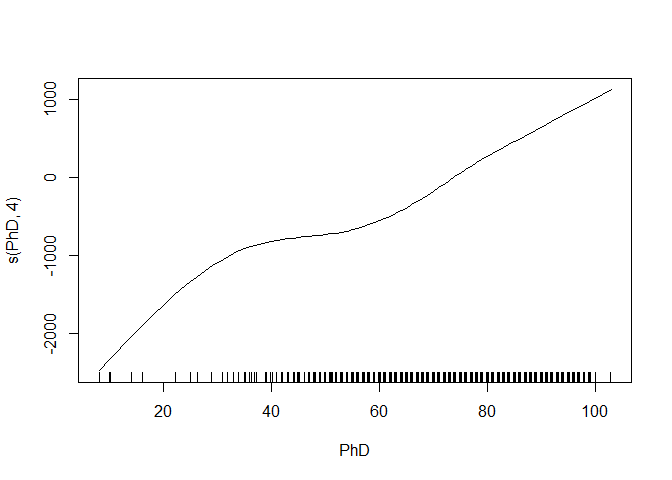
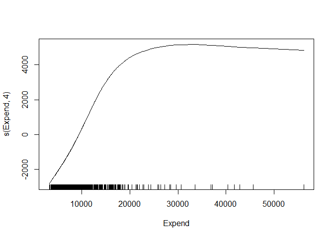

    knitr::opts_chunk$set(echo = TRUE)
    library(ISLR)
    library(dplyr)
    library(leaps)  #used for the regsubset()
    library(gam)    #for gam()
    library(ggplot2)
    data("College")

### Functions used in solutions below

### 10.a

We will conduct a stepwise selection on the training set to identify the
subset with the lowest estimated test error. To estimate test error we
will use measures such as adjusted-R-square, Cp and BIC.

We will then apply the 1 standard deviation rule to choose a smaller
subset with lesser number of predictors whose estimated test error is
within 1 standard deviation of the lowest estimated test error. This
will give us the predictors to use in training a model.

    set.seed(1)
    test.index = sample(1:nrow(College), nrow(College)/2, replace = FALSE)

    regfit = regsubsets(Outstate~., data = College[-test.index,], nvmax = 17)
    regfit.summary = summary(regfit)

    par(mfrow=c(1,3))

    plot(regfit.summary$adjr2, xlab = "Number of Subsets", ylab = "Adj. R-squared", type = "l")
    arsq.max = max(regfit.summary$adjr2)
    arsq.sd = sd(regfit.summary$adjr2)
    abline(h=arsq.max-arsq.sd, col = "red", lty = 2)

    plot(regfit.summary$cp, xlab = "Number of Subsets", ylab = "Cp", type = "l")
    cp.min = min(regfit.summary$cp)
    cp.sd = sd(regfit.summary$cp)
    abline(h=cp.min+cp.sd, col = "red", lty = 2)

    plot(regfit.summary$bic, xlab = "Number of Subsets", ylab = "BIC", type = "l")
    bic.min = min(regfit.summary$bic)
    bic.sd = sd(regfit.summary$bic)
    abline(h=bic.min+bic.sd, col = "red", lty = 2)

    print(paste("Model with least number of predictors within one standard deviation from the model with maximum adjusted R-squared has",which(regfit.summary$adjr2>=arsq.max-arsq.sd)[1], "predictors"))

    ## [1] "Model with least number of predictors within one standard deviation from the model with maximum adjusted R-squared has 4 predictors"

    print(paste("Model with least number of predictors within one standard deviation from the model with minimum Cp has",which(regfit.summary$cp <= cp.min+bic.sd)[1], "predictors"))

    ## [1] "Model with least number of predictors within one standard deviation from the model with minimum Cp has 5 predictors"

    print(paste("Model with least number of predictors within one standard deviation from the model with minimum BIC has",which(regfit.summary$bic <= bic.min+bic.sd)[1], "predictors"))

    ## [1] "Model with least number of predictors within one standard deviation from the model with minimum BIC has 4 predictors"

    print("The selected model contains the following 4 predictors(+Intercept) - ")

    ## [1] "The selected model contains the following 4 predictors(+Intercept) - "

    names(coef(regfit, id=4))

    ## [1] "(Intercept)" "PrivateYes"  "Room.Board"  "PhD"         "Expend"

We are choosing a model with 4 predictors(+Intercept) to train a
non-linear regression model. The 4 predictors chosen are "Private",
"Room.Board", "PhD" and "Expend"

### 10.b

All the predictors selected in the previous step except "Private"" are
continous and hence fitting a GAM, we fit a smoothing spline with 4
degrees of freedom on all predictors except Private

    gam.train = gam(Outstate~Private+s(Room.Board,4)+s(PhD,4)+s(Expend,4), data = College[-test.index,])

### 10.c

We now use this GAM model to predict "Outstate" values for the test
data. To evaluate the quality of the prediction we will compare the RSS
of the GAM model predictions to the RSS of a OLS model predictions that
uses all the 17 predictor variables.

    preds.gam = predict(gam.train, newdata = College[test.index,], type = "response")

    gam.err = (preds.gam-College$Outstate[test.index])^2 %>% mean()
    gam.tss = (College$Outstate[test.index]-mean(College$Outstate[-test.index]))^2 %>% mean()
    gam.rss = 1-gam.err/gam.tss
    gam.rss

    ## [1] 0.7529816

    lm.fit = lm(Outstate~., data = College[-test.index,])
    preds.lm = predict(lm.fit, newdata = College[test.index,], type = "response")
    lm.err = (preds.lm-College$Outstate[test.index])^2 %>% mean()
    lm.tss = (mean(College$Outstate[test.index])-College$Outstate[-test.index])^2 %>% mean()
    lm.rss = 1-lm.err/lm.tss
    lm.rss

    ## [1] 0.7600677

    gam.full = gam(Outstate~Private+s(Room.Board,4)+s(PhD,4)+s(Expend,4), data = College)
    summary(gam.full)

    ## 
    ## Call: gam(formula = Outstate ~ Private + s(Room.Board, 4) + s(PhD, 
    ##     4) + s(Expend, 4), data = College)
    ## Deviance Residuals:
    ##      Min       1Q   Median       3Q      Max 
    ## -8813.13 -1173.49    67.32  1302.76  7820.63 
    ## 
    ## (Dispersion Parameter for gaussian family taken to be 3931394)
    ## 
    ##     Null Deviance: 12559297426 on 776 degrees of freedom
    ## Residual Deviance: 2999654118 on 763.0001 degrees of freedom
    ## AIC: 14019.26 
    ## 
    ## Number of Local Scoring Iterations: 2 
    ## 
    ## Anova for Parametric Effects
    ##                   Df     Sum Sq    Mean Sq F value    Pr(>F)    
    ## Private            1 3379753661 3379753661  859.68 < 2.2e-16 ***
    ## s(Room.Board, 4)   1 2463821002 2463821002  626.70 < 2.2e-16 ***
    ## s(PhD, 4)          1  832787287  832787287  211.83 < 2.2e-16 ***
    ## s(Expend, 4)       1 1317645933 1317645933  335.16 < 2.2e-16 ***
    ## Residuals        763 2999654118    3931394                      
    ## ---
    ## Signif. codes:  0 '***' 0.001 '**' 0.01 '*' 0.05 '.' 0.1 ' ' 1
    ## 
    ## Anova for Nonparametric Effects
    ##                  Npar Df Npar F     Pr(F)    
    ## (Intercept)                                  
    ## Private                                      
    ## s(Room.Board, 4)       3  4.031  0.007362 ** 
    ## s(PhD, 4)              3  1.558  0.198149    
    ## s(Expend, 4)           3 43.149 < 2.2e-16 ***
    ## ---
    ## Signif. codes:  0 '***' 0.001 '**' 0.01 '*' 0.05 '.' 0.1 ' ' 1

    plot(gam.full)

The RSS comparison shows that the GAM model compares very well (0.753)
to OLS model (0.760). More importantly the GAM model is a much simpler
and therefore easier to interpret with only 4 predictor variables as
opposed to the 17 predictor variables in the OLS model.

When we refit the GAM model to the entire dataset we observe from the
p-values for the Annova test for non-parametric effects that for the
predictor "PhD" a linear function will suffice whereas for the
predictors "Room.Board" and "Expend" a non-linear function is required
to explain their effects on the response variable.
