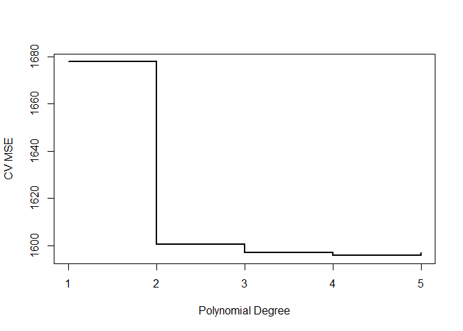
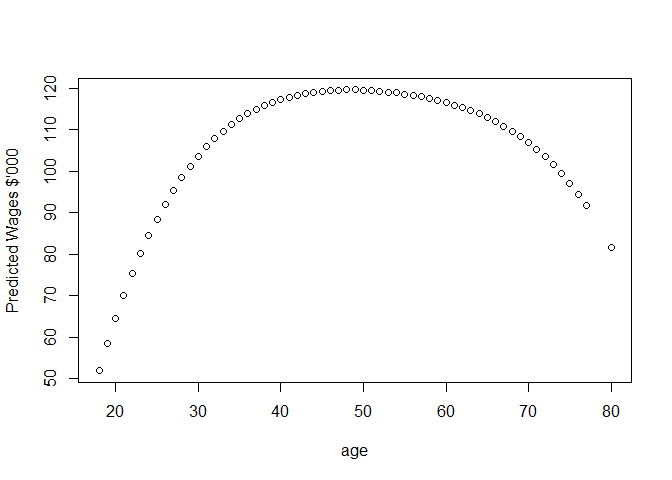
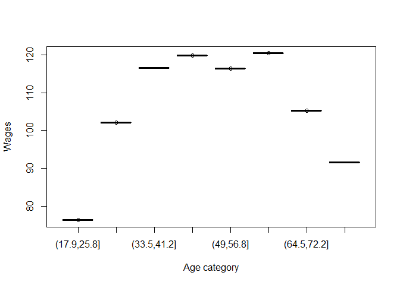

    knitr::opts_chunk$set(echo = TRUE)
    library(ISLR)
    library(tidyverse)
    library(boot) #For cross validation errors
    attach(Wage)

### Functions used in solutions below

    poly.fit.6b = function(x){
      Wage$age.cut = cut(Wage$age,x)
      fit = glm(wage~age.cut, data = Wage)
      cv.error = cv.glm(Wage, fit)$delta[2]
    }

### 6.a

    set.seed(1)
    fold = sample(seq(1:10), nrow(Wage), replace = TRUE)
    no.of.folds = 10
    no.of.degrees = 5
    cv.error.degree = rep(0, no.of.degrees)

    for(j in 1:no.of.degrees){
      cv.error.fold = rep(0, no.of.folds)
      for(i in 1:no.of.folds){
        fit = lm(wage~poly(age,degree = j), data = Wage[fold != i,])
        pred = predict(fit, newdata = Wage[fold == i,], type = "response")
        cv.error.fold[i] = (pred - Wage$wage[fold == i])^2 %>% mean()
      }
      cv.error.degree[j] = mean(cv.error.fold)
    }

    optimal.no.of.degrees = which.min(cv.error.degree)

    plot(x=1:no.of.degrees, y=cv.error.degree, type = "s", lwd = 2, xlab = "Polynomial Degree", ylab = "CV MSE")

    fit.1 = lm(wage~poly(age,1), data = Wage)
    fit.2 = lm(wage~poly(age,2), data = Wage)
    fit.3 = lm(wage~poly(age,3), data = Wage)
    fit.4 = lm(wage~poly(age,4), data = Wage)
    fit.5 = lm(wage~poly(age,5), data = Wage)

    anova(fit.1, fit.2, fit.3, fit.4, fit.5)

    ## Analysis of Variance Table
    ## 
    ## Model 1: wage ~ poly(age, 1)
    ## Model 2: wage ~ poly(age, 2)
    ## Model 3: wage ~ poly(age, 3)
    ## Model 4: wage ~ poly(age, 4)
    ## Model 5: wage ~ poly(age, 5)
    ##   Res.Df     RSS Df Sum of Sq        F    Pr(>F)    
    ## 1   2998 5022216                                    
    ## 2   2997 4793430  1    228786 143.5931 < 2.2e-16 ***
    ## 3   2996 4777674  1     15756   9.8888  0.001679 ** 
    ## 4   2995 4771604  1      6070   3.8098  0.051046 .  
    ## 5   2994 4770322  1      1283   0.8050  0.369682    
    ## ---
    ## Signif. codes:  0 '***' 0.001 '**' 0.01 '*' 0.05 '.' 0.1 ' ' 1

    pred = predict(fit.4, newdata = Wage, type = "response")

    plot(age, pred, ylab = "Predicted Wages $'000")

The cross validation chooses a polynomial of degree 4 as the optimal
level of non-linearlity. The first graph does show that the cross
validation error is indeed least at degree = 4. However it may be noted
that the reduction of the cross validation error from degree 3 to degree
4 is trivial.

The Anova analysis corroborates this finding. The p-values of degree 2
and degree 3 indicate that they provide a much better fit than a fit of
correspondingly lower degree. The p-value of degree 4 indicates that the
improvement over degree 3 is minimal and that degree 5 is unnecessary.
This is in line with the cross validation results.

### 6.b

    set.seed(10)
    # cv.error = sapply(2:10, poly.fit.6b)
    no.of.cuts = 10
    set.seed(1)
    cv.error.degree = rep(NA, no.of.cuts)
    for (j in 2:no.of.cuts){
      cv.error.fold = rep(0, no.of.folds)
      Wage$age.cut = cut(Wage$age, j)
      for (i in 1:no.of.folds){
        fit = lm(wage~age.cut, data = Wage[fold != i,])
        pred = predict(fit, newdata = Wage[fold == i,], type = "response")
        cv.error.fold[i] = (pred-Wage$wage[fold == i])^2 %>% mean()
      }
      cv.error.degree[j] = mean(cv.error.fold)
    }
    optimal.no.of.cuts = which.min(cv.error.degree)
    print(paste("Optimal number of cuts = ",optimal.no.of.cuts))

    ## [1] "Optimal number of cuts =  8"

    fit = lm(wage~cut(age, optimal.no.of.cuts), data = Wage)
    plot(cut(Wage$age, optimal.no.of.cuts), fit$fitted.values, ylab = "Wages", xlab = "Age category")

