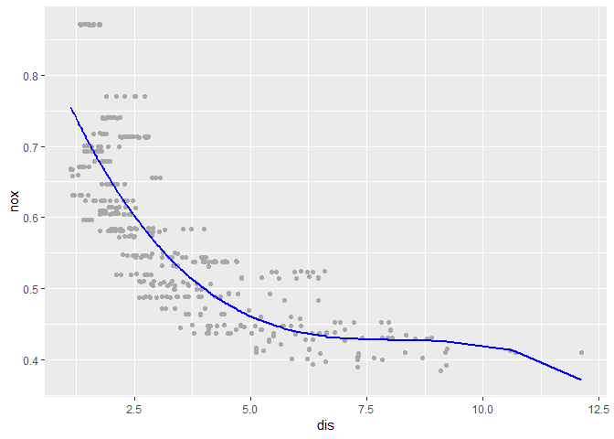
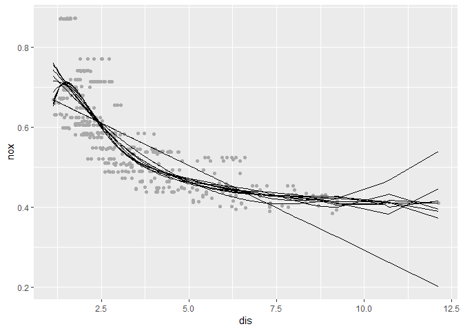
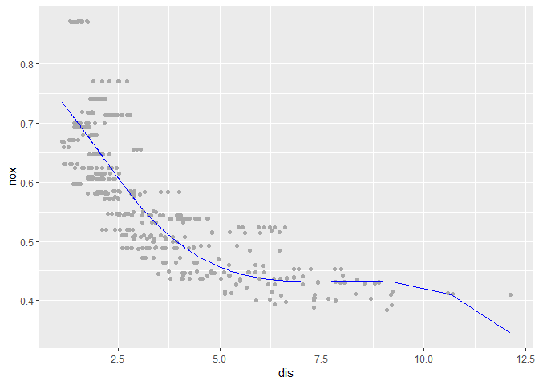
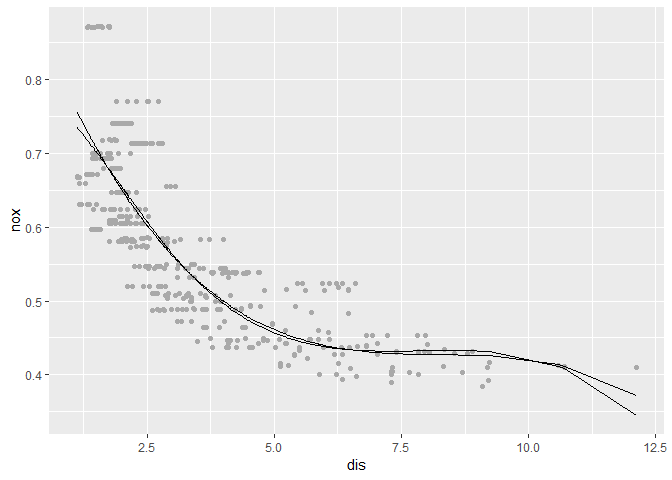
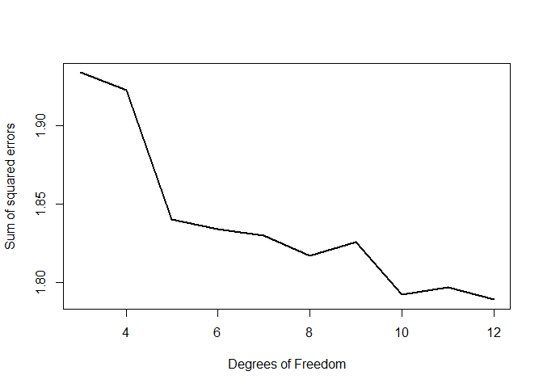

    knitr::opts_chunk$set(echo = TRUE)
    library(MASS)
    library(dplyr)
    library(boot) #used for the cv.glm()
    library(splines)
    library(ggplot2)
    data("Boston")

### Functions used in solutions below

    poly.fit.9b = function(d){
      fit = lm(nox~poly(dis,d), data = Boston)
      preds = predict(fit, newdata = Boston, type = "response")
    }

    poly.fit.9c = function(d){
      fit = glm(nox~poly(dis,d), data = Boston)
      cv.error = cv.glm(Boston, fit, K = 5)$delta[2] #K=5, choosing the number of folds
    }

    poly.fit.9e = function(d){
      fit = lm(nox~bs(dis, df=d), data = Boston)
      preds = predict(fit, newdata = Boston, type = "response")
    }

    poly.fit.9f = function(d){
      fit = glm(nox~bs(dis,d), data = Boston)
      cv.error = cv.glm(Boston, fit, K = 5)$delta[2]
    }

### 9.a

    fit = lm(nox~poly(dis, 3), data = Boston)
    summary(fit)

    ## 
    ## Call:
    ## lm(formula = nox ~ poly(dis, 3), data = Boston)
    ## 
    ## Residuals:
    ##       Min        1Q    Median        3Q       Max 
    ## -0.121130 -0.040619 -0.009738  0.023385  0.194904 
    ## 
    ## Coefficients:
    ##                Estimate Std. Error t value Pr(>|t|)    
    ## (Intercept)    0.554695   0.002759 201.021  < 2e-16 ***
    ## poly(dis, 3)1 -2.003096   0.062071 -32.271  < 2e-16 ***
    ## poly(dis, 3)2  0.856330   0.062071  13.796  < 2e-16 ***
    ## poly(dis, 3)3 -0.318049   0.062071  -5.124 4.27e-07 ***
    ## ---
    ## Signif. codes:  0 '***' 0.001 '**' 0.01 '*' 0.05 '.' 0.1 ' ' 1
    ## 
    ## Residual standard error: 0.06207 on 502 degrees of freedom
    ## Multiple R-squared:  0.7148, Adjusted R-squared:  0.7131 
    ## F-statistic: 419.3 on 3 and 502 DF,  p-value: < 2.2e-16

    preds = predict(fit, newdata = Boston, type = "response")
    Boston.9a = Boston %>% mutate(predicted.nox = preds)

    Boston.9a %>% ggplot(aes(dis, nox))+geom_point(position = "jitter", col = "darkgrey")+ geom_line(aes(dis, predicted.nox), col = "blue", size = 1)

The summary of the cubic polynomial regression to predict nox using dis
clearly shows that the cubic fit provides a good explanation between nox
and dis.

### 9.b

    preds.multi = sapply(1:10, poly.fit.9b)
    Boston.9b = Boston %>% mutate(predicted.nox.1 = preds.multi[,1], predicted.nox.2 = preds.multi[,2],
                               predicted.nox.3 = preds.multi[,3], predicted.nox.4 = preds.multi[,4],
                               predicted.nox.5 = preds.multi[,5], predicted.nox.6 = preds.multi[,6],
                               predicted.nox.7 = preds.multi[,7], predicted.nox.8 = preds.multi[,8],
                               predicted.nox.9 = preds.multi[,9], predicted.nox.10 = preds.multi[,10])
    Boston.9b %>% ggplot(aes(dis,nox))+ geom_point(col = "darkgrey", position = "jitter")+
      geom_line(aes(dis, predicted.nox.1))+
      geom_line(aes(dis, predicted.nox.2))+
      geom_line(aes(dis, predicted.nox.3))+
      geom_line(aes(dis, predicted.nox.4))+
      geom_line(aes(dis, predicted.nox.5))+
      geom_line(aes(dis, predicted.nox.6))+
      geom_line(aes(dis, predicted.nox.7))+
      geom_line(aes(dis, predicted.nox.8))+
      geom_line(aes(dis, predicted.nox.9))+
      geom_line(aes(dis, predicted.nox.10))

    res.df = data.frame(res.1 = (Boston.9b$nox-Boston.9b$predicted.nox.1)^2,
                        res.2 = (Boston.9b$nox-Boston.9b$predicted.nox.2)^2,
                        res.3 = (Boston.9b$nox-Boston.9b$predicted.nox.3)^2,
                        res.4 = (Boston.9b$nox-Boston.9b$predicted.nox.4)^2,
                        res.5 = (Boston.9b$nox-Boston.9b$predicted.nox.5)^2,
                        res.6 = (Boston.9b$nox-Boston.9b$predicted.nox.6)^2,
                        res.7 = (Boston.9b$nox-Boston.9b$predicted.nox.7)^2,
                        res.8 = (Boston.9b$nox-Boston.9b$predicted.nox.8)^2,
                        res.9 = (Boston.9b$nox-Boston.9b$predicted.nox.9)^2,
                        res.10 = (Boston.9b$nox-Boston.9b$predicted.nox.10)^2)
    res.df = colSums(res.df)
    res.df

    ##    res.1    res.2    res.3    res.4    res.5    res.6    res.7    res.8 
    ## 2.768563 2.035262 1.934107 1.932981 1.915290 1.878257 1.849484 1.835630 
    ##    res.9   res.10 
    ## 1.833331 1.832171

### 9.c

    set.seed(1)
    cv.error = sapply(1:10, poly.fit.9c)
    which.min(cv.error)

    ## [1] 4

Using the cross validated test set mean square error we conclude that a
polynomial of the 4th degree is the most appropriate polynomial
regression fit to predict nox using dis as the predictor variable.

### 9.d

    fit = lm(nox~bs(dis, df = 4), data = Boston)
    summary(fit)

    ## 
    ## Call:
    ## lm(formula = nox ~ bs(dis, df = 4), data = Boston)
    ## 
    ## Residuals:
    ##       Min        1Q    Median        3Q       Max 
    ## -0.124622 -0.039259 -0.008514  0.020850  0.193891 
    ## 
    ## Coefficients:
    ##                  Estimate Std. Error t value Pr(>|t|)    
    ## (Intercept)       0.73447    0.01460  50.306  < 2e-16 ***
    ## bs(dis, df = 4)1 -0.05810    0.02186  -2.658  0.00812 ** 
    ## bs(dis, df = 4)2 -0.46356    0.02366 -19.596  < 2e-16 ***
    ## bs(dis, df = 4)3 -0.19979    0.04311  -4.634 4.58e-06 ***
    ## bs(dis, df = 4)4 -0.38881    0.04551  -8.544  < 2e-16 ***
    ## ---
    ## Signif. codes:  0 '***' 0.001 '**' 0.01 '*' 0.05 '.' 0.1 ' ' 1
    ## 
    ## Residual standard error: 0.06195 on 501 degrees of freedom
    ## Multiple R-squared:  0.7164, Adjusted R-squared:  0.7142 
    ## F-statistic: 316.5 on 4 and 501 DF,  p-value: < 2.2e-16

    attr(bs(Boston$dis, df = 4), "knots")

    ##     50% 
    ## 3.20745

    data.frame(dis=Boston$dis, nox=Boston$nox, predicted.nox=fit$fitted.values) %>%
      ggplot(aes(dis,nox))+ geom_point(col="dark grey", position="jitter")+ 
      geom_line(aes(dis, predicted.nox), col = "blue")

We decided on the location of the knots by specifying the degrees of
freedom desired in the bs() function. In this case, this amounted to
specifying the degress of freedom as 4. This produces a cubic spline
regression fit with one knot placed at the 50th percentile of the range
of dis.

### 9.e

    preds.multi = sapply(3:12, poly.fit.9e)

    Boston.9e = Boston %>% mutate(predicted.nox.3 = preds.multi[,1], predicted.nox.4 = preds.multi[,2],
                                  predicted.nox.5 = preds.multi[,1], predicted.nox.6 = preds.multi[,2],
                                  predicted.nox.7 = preds.multi[,1], predicted.nox.8 = preds.multi[,2],
                                  predicted.nox.9 = preds.multi[,1], predicted.nox.10 = preds.multi[,2],
                                  predicted.nox.11 = preds.multi[,1], predicted.nox.12 = preds.multi[,2])

    Boston.9e %>% ggplot(aes(dis,nox))+ geom_point(position = "jitter", col = "dark grey")+
      geom_line(aes(dis, predicted.nox.3))+ geom_line(aes(dis, predicted.nox.4))+
      geom_line(aes(dis, predicted.nox.5))+ geom_line(aes(dis, predicted.nox.6))+
      geom_line(aes(dis, predicted.nox.7))+ geom_line(aes(dis, predicted.nox.8))+
      geom_line(aes(dis, predicted.nox.9))+ geom_line(aes(dis, predicted.nox.10))+
      geom_line(aes(dis, predicted.nox.11))+ geom_line(aes(dis, predicted.nox.12))

    res.df = data.frame(res.3 = (preds.multi[,1]-Boston$nox)^2, res.4 = (preds.multi[,2]-Boston$nox)^2,
                        res.5 = (preds.multi[,3]-Boston$nox)^2, res.6 = (preds.multi[,4]-Boston$nox)^2,
                        res.7 = (preds.multi[,5]-Boston$nox)^2, res.8 = (preds.multi[,6]-Boston$nox)^2,
                        res.9 = (preds.multi[,7]-Boston$nox)^2, res.10 = (preds.multi[,8]-Boston$nox)^2,
                        res.11 = (preds.multi[,9]-Boston$nox)^2, res.12= (preds.multi[,10]-Boston$nox)^2)           %>% colSums(.)
    res.df

    ##    res.3    res.4    res.5    res.6    res.7    res.8    res.9   res.10 
    ## 1.934107 1.922775 1.840173 1.833966 1.829884 1.816995 1.825653 1.792535 
    ##   res.11   res.12 
    ## 1.796992 1.788999

    plot(3:12, res.df, type = "l", lwd = "2", xlab = "Degrees of Freedom", ylab = "Sum of squared errors")

We fitted regression splines for degrees of freedom varying from 3
through 12. We then caclulated the sum of square errors for each degree.
The results show that sum of square errors reduces almost monotonically
as the degrees of freedom increases.

### 9.f

    set.seed(1)
    cv.error = sapply(3:12, poly.fit.9f)

    ## Warning in bs(dis, degree = 3L, knots = numeric(0), Boundary.knots =
    ## c(1.1296, : some 'x' values beyond boundary knots may cause ill-conditioned
    ## bases

    ## Warning in bs(dis, degree = 3L, knots = numeric(0), Boundary.knots =
    ## c(1.1296, : some 'x' values beyond boundary knots may cause ill-conditioned
    ## bases

    ## Warning in bs(dis, degree = 3L, knots = numeric(0), Boundary.knots =
    ## c(1.137, : some 'x' values beyond boundary knots may cause ill-conditioned
    ## bases

    ## Warning in bs(dis, degree = 3L, knots = numeric(0), Boundary.knots =
    ## c(1.137, : some 'x' values beyond boundary knots may cause ill-conditioned
    ## bases

    ## Warning in bs(dis, degree = 3L, knots = c(`50%` = 3.3603), Boundary.knots =
    ## c(1.137, : some 'x' values beyond boundary knots may cause ill-conditioned
    ## bases

    ## Warning in bs(dis, degree = 3L, knots = c(`50%` = 3.3603), Boundary.knots =
    ## c(1.137, : some 'x' values beyond boundary knots may cause ill-conditioned
    ## bases

    ## Warning in bs(dis, degree = 3L, knots = c(`50%` = 3.20745), Boundary.knots
    ## = c(1.1296, : some 'x' values beyond boundary knots may cause ill-
    ## conditioned bases

    ## Warning in bs(dis, degree = 3L, knots = c(`50%` = 3.20745), Boundary.knots
    ## = c(1.1296, : some 'x' values beyond boundary knots may cause ill-
    ## conditioned bases

    ## Warning in bs(dis, degree = 3L, knots = c(`33.33333%` = 2.29316666666667, :
    ## some 'x' values beyond boundary knots may cause ill-conditioned bases

    ## Warning in bs(dis, degree = 3L, knots = c(`33.33333%` = 2.29316666666667, :
    ## some 'x' values beyond boundary knots may cause ill-conditioned bases

    ## Warning in bs(dis, degree = 3L, knots = c(`33.33333%` = 2.34846666666667, :
    ## some 'x' values beyond boundary knots may cause ill-conditioned bases

    ## Warning in bs(dis, degree = 3L, knots = c(`33.33333%` = 2.34846666666667, :
    ## some 'x' values beyond boundary knots may cause ill-conditioned bases

    ## Warning in bs(dis, degree = 3L, knots = c(`25%` = 2.1069, `50%` = 3.1323, :
    ## some 'x' values beyond boundary knots may cause ill-conditioned bases

    ## Warning in bs(dis, degree = 3L, knots = c(`25%` = 2.1069, `50%` = 3.1323, :
    ## some 'x' values beyond boundary knots may cause ill-conditioned bases

    ## Warning in bs(dis, degree = 3L, knots = c(`25%` = 2.1036, `50%` = 3.2797, :
    ## some 'x' values beyond boundary knots may cause ill-conditioned bases

    ## Warning in bs(dis, degree = 3L, knots = c(`25%` = 2.1036, `50%` = 3.2797, :
    ## some 'x' values beyond boundary knots may cause ill-conditioned bases

    ## Warning in bs(dis, degree = 3L, knots = c(`20%` = 1.96062, `40%` =
    ## 2.65254, : some 'x' values beyond boundary knots may cause ill-conditioned
    ## bases

    ## Warning in bs(dis, degree = 3L, knots = c(`20%` = 1.96062, `40%` =
    ## 2.65254, : some 'x' values beyond boundary knots may cause ill-conditioned
    ## bases

    ## Warning in bs(dis, degree = 3L, knots = c(`20%` = 1.9879, `40%` = 2.7175, :
    ## some 'x' values beyond boundary knots may cause ill-conditioned bases

    ## Warning in bs(dis, degree = 3L, knots = c(`20%` = 1.9879, `40%` = 2.7175, :
    ## some 'x' values beyond boundary knots may cause ill-conditioned bases

    ## Warning in bs(dis, degree = 3L, knots = c(`16.66667%` = 1.82461666666667, :
    ## some 'x' values beyond boundary knots may cause ill-conditioned bases

    ## Warning in bs(dis, degree = 3L, knots = c(`16.66667%` = 1.82461666666667, :
    ## some 'x' values beyond boundary knots may cause ill-conditioned bases

    ## Warning in bs(dis, degree = 3L, knots = c(`16.66667%` = 1.864, `33.33333%`
    ## = 2.4214, : some 'x' values beyond boundary knots may cause ill-conditioned
    ## bases

    ## Warning in bs(dis, degree = 3L, knots = c(`16.66667%` = 1.864, `33.33333%`
    ## = 2.4214, : some 'x' values beyond boundary knots may cause ill-conditioned
    ## bases

    ## Warning in bs(dis, degree = 3L, knots = c(`14.28571%` = 1.78564285714286, :
    ## some 'x' values beyond boundary knots may cause ill-conditioned bases

    ## Warning in bs(dis, degree = 3L, knots = c(`14.28571%` = 1.78564285714286, :
    ## some 'x' values beyond boundary knots may cause ill-conditioned bases

    ## Warning in bs(dis, degree = 3L, knots = c(`14.28571%` = 1.78741428571429, :
    ## some 'x' values beyond boundary knots may cause ill-conditioned bases

    ## Warning in bs(dis, degree = 3L, knots = c(`14.28571%` = 1.78741428571429, :
    ## some 'x' values beyond boundary knots may cause ill-conditioned bases

    ## Warning in bs(dis, degree = 3L, knots = c(`12.5%` = 1.7266, `25%` =
    ## 2.087875, : some 'x' values beyond boundary knots may cause ill-conditioned
    ## bases

    ## Warning in bs(dis, degree = 3L, knots = c(`12.5%` = 1.7266, `25%` =
    ## 2.087875, : some 'x' values beyond boundary knots may cause ill-conditioned
    ## bases

    ## Warning in bs(dis, degree = 3L, knots = c(`12.5%` = 1.7572375, `25%` =
    ## 2.087875, : some 'x' values beyond boundary knots may cause ill-conditioned
    ## bases

    ## Warning in bs(dis, degree = 3L, knots = c(`12.5%` = 1.7572375, `25%` =
    ## 2.087875, : some 'x' values beyond boundary knots may cause ill-conditioned
    ## bases

    ## Warning in bs(dis, degree = 3L, knots = c(`11.11111%` = 1.63994444444444, :
    ## some 'x' values beyond boundary knots may cause ill-conditioned bases

    ## Warning in bs(dis, degree = 3L, knots = c(`11.11111%` = 1.63994444444444, :
    ## some 'x' values beyond boundary knots may cause ill-conditioned bases

    ## Warning in bs(dis, degree = 3L, knots = c(`10%` = 1.6172, `20%` = 1.9123, :
    ## some 'x' values beyond boundary knots may cause ill-conditioned bases

    ## Warning in bs(dis, degree = 3L, knots = c(`10%` = 1.6172, `20%` = 1.9123, :
    ## some 'x' values beyond boundary knots may cause ill-conditioned bases

    ## Warning in bs(dis, degree = 3L, knots = c(`10%` = 1.61512, `20%` =
    ## 1.97036, : some 'x' values beyond boundary knots may cause ill-conditioned
    ## bases

    ## Warning in bs(dis, degree = 3L, knots = c(`10%` = 1.61512, `20%` =
    ## 1.97036, : some 'x' values beyond boundary knots may cause ill-conditioned
    ## bases

    which.min(cv.error)

    ## [1] 6

Cross validation recommends that we choose a regression spline with 8
degrees of freedom for the lowest test-set mean of squared errors.
