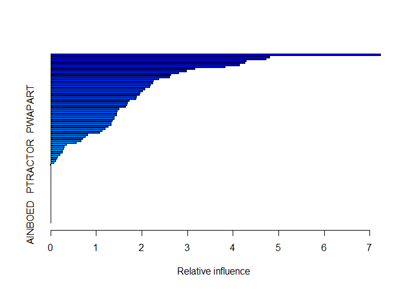

    knitr::opts_chunk$set(echo = TRUE)
    library(dplyr)
    library(gbm)
    library(ISLR)
    library(ggplot2)
    library(class)

    data(Caravan)

### 11.a

    train = 1:1000

### 11.b

    set.seed(1970)
    Caravan = Caravan %>% mutate(Purchase = ifelse(Purchase == "No", 0,1))
    boost.Caravan = gbm(Purchase~., data = Caravan[train,], distribution = "bernoulli",
                        n.trees = 1000, shrinkage = 0.01, interaction.depth = 4)

    ## Warning in gbm.fit(x = x, y = y, offset = offset, distribution =
    ## distribution, : variable 50: PVRAAUT has no variation.

    ## Warning in gbm.fit(x = x, y = y, offset = offset, distribution =
    ## distribution, : variable 71: AVRAAUT has no variation.

    boost.Caravan

    ## gbm(formula = Purchase ~ ., distribution = "bernoulli", data = Caravan[train, 
    ##     ], n.trees = 1000, interaction.depth = 4, shrinkage = 0.01)
    ## A gradient boosted model with bernoulli loss function.
    ## 1000 iterations were performed.
    ## There were 85 predictors of which 57 had non-zero influence.

    summary(boost.Caravan)

    ##               var     rel.inf
    ## PPERSAUT PPERSAUT 7.234064316
    ## MGODGE     MGODGE 4.802257223
    ## MKOOPKLA MKOOPKLA 4.720359436
    ## MOPLHOOG MOPLHOOG 4.280843561
    ## MOSTYPE   MOSTYPE 4.265027657
    ## PBRAND     PBRAND 4.143624144
    ## MBERMIDD MBERMIDD 3.825890156
    ## MGODPR     MGODPR 3.160904786
    ## MAUT2       MAUT2 2.975729912
    ## MSKC         MSKC 2.810216149
    ## MINK3045 MINK3045 2.639744321
    ## MBERARBG MBERARBG 2.609420449
    ## MSKA         MSKA 2.368971893
    ## MSKB1       MSKB1 2.251934331
    ## MAUT1       MAUT1 2.234882764
    ## MBERARBO MBERARBO 2.182550349
    ## MBERHOOG MBERHOOG 2.173297878
    ## MRELOV     MRELOV 2.065797345
    ## MOPLMIDD MOPLMIDD 2.007436320
    ## MGODOV     MGODOV 1.961660165
    ## MINKM30   MINKM30 1.951260788
    ## MRELGE     MRELGE 1.880542182
    ## MINK7512 MINK7512 1.862915064
    ## MSKB2       MSKB2 1.715782598
    ## MRELSA     MRELSA 1.681627684
    ## MZFONDS   MZFONDS 1.663027102
    ## MFWEKIND MFWEKIND 1.648402315
    ## PWAPART   PWAPART 1.498530405
    ## MFALLEEN MFALLEEN 1.452304409
    ## ABRAND     ABRAND 1.444228973
    ## MGEMLEEF MGEMLEEF 1.438192659
    ## MHKOOP     MHKOOP 1.395006919
    ## MAUT0       MAUT0 1.391666915
    ## MFGEKIND MFGEKIND 1.348835064
    ## MHHUUR     MHHUUR 1.331713560
    ## MINKGEM   MINKGEM 1.329523386
    ## MGODRK     MGODRK 1.258910056
    ## MOSHOOFD MOSHOOFD 1.188707937
    ## MZPART     MZPART 1.132191640
    ## MINK4575 MINK4575 1.074956863
    ## MGEMOMV   MGEMOMV 0.814821168
    ## APERSAUT APERSAUT 0.750765656
    ## MBERZELF MBERZELF 0.703226927
    ## MSKD         MSKD 0.658757923
    ## MOPLLAAG MOPLLAAG 0.558623075
    ## AWAPART   AWAPART 0.346502340
    ## PMOTSCO   PMOTSCO 0.293665244
    ## MBERBOER MBERBOER 0.286249834
    ## PLEVEN     PLEVEN 0.257971837
    ## AMOTSCO   AMOTSCO 0.250995854
    ## MINK123M MINK123M 0.199894146
    ## ABYSTAND ABYSTAND 0.150919645
    ## MAANTHUI MAANTHUI 0.133013539
    ## PBYSTAND PBYSTAND 0.103298844
    ## ALEVEN     ALEVEN 0.075611724
    ## AAANHANG AAANHANG 0.006610511
    ## PTRACTOR PTRACTOR 0.006132058
    ## PWABEDR   PWABEDR 0.000000000
    ## PWALAND   PWALAND 0.000000000
    ## PBESAUT   PBESAUT 0.000000000
    ## PVRAAUT   PVRAAUT 0.000000000
    ## PAANHANG PAANHANG 0.000000000
    ## PWERKT     PWERKT 0.000000000
    ## PBROM       PBROM 0.000000000
    ## PPERSONG PPERSONG 0.000000000
    ## PGEZONG   PGEZONG 0.000000000
    ## PWAOREG   PWAOREG 0.000000000
    ## PZEILPL   PZEILPL 0.000000000
    ## PPLEZIER PPLEZIER 0.000000000
    ## PFIETS     PFIETS 0.000000000
    ## PINBOED   PINBOED 0.000000000
    ## AWABEDR   AWABEDR 0.000000000
    ## AWALAND   AWALAND 0.000000000
    ## ABESAUT   ABESAUT 0.000000000
    ## AVRAAUT   AVRAAUT 0.000000000
    ## ATRACTOR ATRACTOR 0.000000000
    ## AWERKT     AWERKT 0.000000000
    ## ABROM       ABROM 0.000000000
    ## APERSONG APERSONG 0.000000000
    ## AGEZONG   AGEZONG 0.000000000
    ## AWAOREG   AWAOREG 0.000000000
    ## AZEILPL   AZEILPL 0.000000000
    ## APLEZIER APLEZIER 0.000000000
    ## AFIETS     AFIETS 0.000000000
    ## AINBOED   AINBOED 0.000000000

"PPERSAUT" has the most import in predicting "Purchase". Overall only 57
of the 85 predictors have a non-zero influence.

### 11.c

    set.seed(1970)
    pred.boost = predict(boost.Caravan, newdata = Caravan[-train,], n.trees = 1000, type = "response")
    yhat.boost = ifelse(pred.boost<=0.2, 0, 1)
    conf.matrix.boost = table(Prediction = yhat.boost, Actual = Caravan[-train,"Purchase"])
    conf.matrix.boost

    ##           Actual
    ## Prediction    0    1
    ##          0 4337  259
    ##          1  196   30

    x.boost = conf.matrix.boost[2,2]/(conf.matrix.boost[2,1]+conf.matrix.boost[2,2])
    x.boost

    ## [1] 0.1327434

    standardized.X = scale(Caravan[,-86]) #Standardizing the predictors
    train.X = standardized.X[train,]; test.X = standardized.X[-train,]
    train.Y = as.factor(Caravan$Purchase[train]); test.Y = as.factor(Caravan$Purchase[-train])

    #5 nearest neighbours are chosen to make the prediction. 5 is chosen as it was shown to provide the best results in an earlier exercise.
    knn.Caravan = knn(train = train.X, test = test.X, cl = train.Y, k = 5)
    conf.matrix.knn = table(Prediction = knn.Caravan, Actual = test.Y)
    conf.matrix.knn

    ##           Actual
    ## Prediction    0    1
    ##          0 4506  279
    ##          1   27   10

    x.knn = conf.matrix.knn[2,2]/(conf.matrix.knn[2,1]+conf.matrix.knn[2,2])
    x.knn

    ## [1] 0.2702703

    glm.Caravan = glm(as.factor(Purchase)~., data = Caravan, subset = train, family = "binomial")

    ## Warning: glm.fit: fitted probabilities numerically 0 or 1 occurred

    pred.glm = predict(glm.Caravan, newdata = Caravan[-train,], type = "response")

    ## Warning in predict.lm(object, newdata, se.fit, scale = 1, type =
    ## ifelse(type == : prediction from a rank-deficient fit may be misleading

    yhat.glm = ifelse(pred.glm <= 0.2, 0, 1)
    conf.matrix.glm = table(Prediction = yhat.glm, Actual = Caravan[-train,"Purchase"])
    conf.matrix.glm

    ##           Actual
    ## Prediction    0    1
    ##          0 4183  231
    ##          1  350   58

    x.glm = conf.matrix.glm[2,2]/(conf.matrix.glm[2,1]+conf.matrix.glm[2,2])
    x.glm

    ## [1] 0.1421569

For Boosting Classification Model, 13.27% of people predicted to make
purchase do in fact make one. For KNN Classification Model, 27.02% of
people predicted to make purchase do in fact make one. Fot Logistic
Regression Model, 14.22% of people predicted to make purchase do in fact
make one.

The Boosting Classification Model does the worst of all 3 models.
