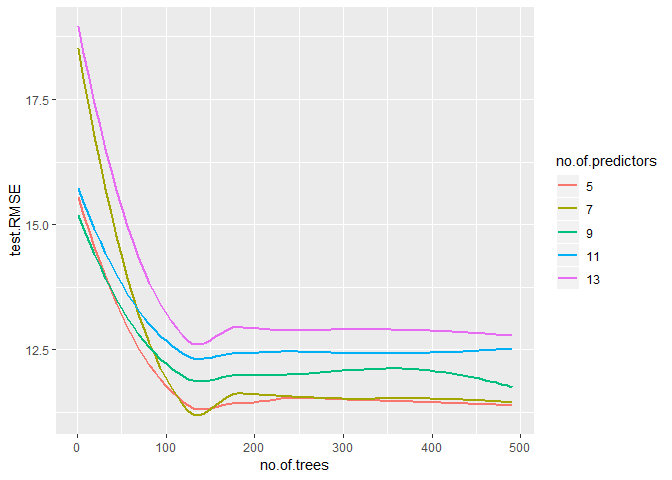

    knitr::opts_chunk$set(echo = TRUE)
    library(dplyr)
    library(randomForest)
    library(MASS)
    library(ggplot2)
    library(reshape2)

    data(Boston)

### 7.a

1.  We first split the Boston database into a training set and test set.
2.  We then created a series of options for the "mtry" and "ntree"
    variables.
3.  We then ran a series of Random Forest regression fits on the
    training sample for each mtry and ntree option.
4.  For each fit, we calculated the MSE for the prediction on the test
    set.

<!-- -->

    set.seed(1)
    train = sample(1:nrow(Boston), nrow(Boston)/2, replace = FALSE)

    mtry.opt = seq(5, 13, 2)
    ntree.opt = seq(1, 500, 10)

    test.error = matrix(data = rep(0, length(ntree.opt)*length(mtry.opt)), nrow = length(ntree.opt), ncol = length(mtry.opt))

    for(j in 1:ncol(test.error)){
      for(i in 1:nrow(test.error)){
        rf.fit = randomForest(medv~., data = Boston, subset = train, mtry = mtry.opt[j], ntree = ntree.opt[i])
        y.hat = predict(rf.fit, newdata = Boston[-train,])
        test.error[i,j] = (y.hat-Boston[-train, "medv"])^2 %>% mean()
      }
    }

### 7.b

    test.error %>% data.frame() %>% `colnames<-`(as.character(mtry.opt)) %>% 
      cbind(no.of.trees = ntree.opt,.) %>% 
      melt(id.vars = "no.of.trees", variable.name = "no.of.predictors", value.name = "test.RMSE") %>%
      ggplot(aes(no.of.trees, test.RMSE, group = no.of.predictors, color = no.of.predictors))+ 
      geom_smooth(se = FALSE)

    ## `geom_smooth()` using method = 'loess' and formula 'y ~ x'

The MSE for each value of mtry tends to a central value with about a 200
tree ensemble. The MSE is lowest for mtry = 5.
