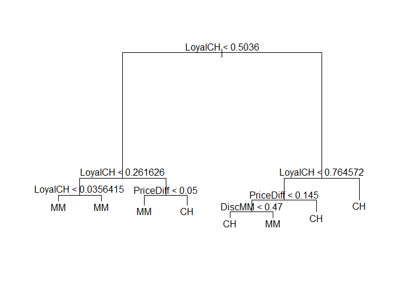
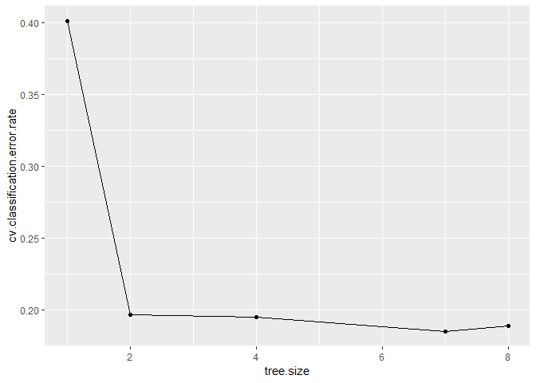
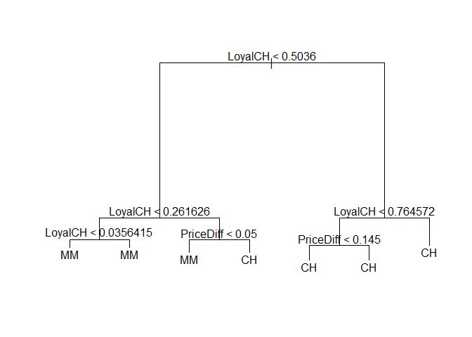

    knitr::opts_chunk$set(echo = TRUE)
    library(dplyr)
    library(tree)
    library(ISLR)
    library(ggplot2)

    data(OJ)

### 9.a

    set.seed(1970)
    train = sample(1:nrow(OJ), 800, replace = FALSE)

### 9.b

    tree.purchase = tree(Purchase~., data = OJ, subset = train)
    summary(tree.purchase)

    ## 
    ## Classification tree:
    ## tree(formula = Purchase ~ ., data = OJ, subset = train)
    ## Variables actually used in tree construction:
    ## [1] "LoyalCH"   "PriceDiff" "DiscMM"   
    ## Number of terminal nodes:  8 
    ## Residual mean deviance:  0.7161 = 567.1 / 792 
    ## Misclassification error rate: 0.1625 = 130 / 800

The tree has 8 terminal nodes and a misclassification error rate of
16.25%

### 9.c

    tree.purchase

    ## node), split, n, deviance, yval, (yprob)
    ##       * denotes terminal node
    ## 
    ##  1) root 800 1078.000 CH ( 0.59875 0.40125 )  
    ##    2) LoyalCH < 0.5036 357  411.600 MM ( 0.26331 0.73669 )  
    ##      4) LoyalCH < 0.261626 161  104.200 MM ( 0.09938 0.90062 )  
    ##        8) LoyalCH < 0.0356415 60    0.000 MM ( 0.00000 1.00000 ) *
    ##        9) LoyalCH > 0.0356415 101   88.280 MM ( 0.15842 0.84158 ) *
    ##      5) LoyalCH > 0.261626 196  263.500 MM ( 0.39796 0.60204 )  
    ##       10) PriceDiff < 0.05 80   77.210 MM ( 0.18750 0.81250 ) *
    ##       11) PriceDiff > 0.05 116  159.900 CH ( 0.54310 0.45690 ) *
    ##    3) LoyalCH > 0.5036 443  343.900 CH ( 0.86907 0.13093 )  
    ##      6) LoyalCH < 0.764572 178  209.500 CH ( 0.72472 0.27528 )  
    ##       12) PriceDiff < 0.145 75  104.000 CH ( 0.50667 0.49333 )  
    ##         24) DiscMM < 0.47 61   81.770 CH ( 0.60656 0.39344 ) *
    ##         25) DiscMM > 0.47 14    7.205 MM ( 0.07143 0.92857 ) *
    ##       13) PriceDiff > 0.145 103   74.140 CH ( 0.88350 0.11650 ) *
    ##      7) LoyalCH > 0.764572 265   78.580 CH ( 0.96604 0.03396 ) *

The first split in the tree is governed by whether the "Customer brand
loyalty for CH" (LoyalCH) is less than 0.5036. There are 357
observations that answer Yes to this question. For these observations
the next split is governed by whether LoyalCH is less than 0.261626.
There are 161 observations that answer Yes to this question. For these
observations the next split is governed by whether LoyalCH is less than
0.0356415. There are 60 observations that answer Yes to this question
and 100% of these observations are MM purchases. This is the terminal
node number 8.

### 9.d

    plot(tree.purchase)
    text(tree.purchase, pretty = 0)

Customers that are loyal to CH (LoyalCH greater than 0.5036) show a
strong propensity to buy CH. They are not swayed even if MM is priced
$0.145 less than CH. The only driver for a LoyalCH customer to shift to
MM is when MM is priced atleast $0.145 less than CH and it represents an
almost 50% discount to the price of CH.

Customers who have very low loyalty to CH (less than 0.261626) always
purchase MM. In other words, they are loyal MM customers.

Customers that are somewhat loyal to CH (greater than 0.261626 & less
than 0.5036) can be incentivized to buy CH as long as it is atleast
$0.05 cheaper than MM.

Clearly CH is the more preferred brand amongst the training set
observations.

### 9.e

    yhat.tree = predict(tree.purchase, newdata = OJ[-train,], type = "class")
    table(yhat.tree, reference = OJ[-train, "Purchase"])

    ##          reference
    ## yhat.tree  CH  MM
    ##        CH 155  30
    ##        MM  19  66

    1-(155+66)/(1070-800)

    ## [1] 0.1814815

The test error rate is 18.15%

### 9.f

    cv.purchase = cv.tree(tree.purchase, FUN = prune.misclass)
    cv.purchase

    ## $size
    ## [1] 8 7 4 2 1
    ## 
    ## $dev
    ## [1] 151 148 156 157 321
    ## 
    ## $k
    ## [1] -Inf    0    4    5  169
    ## 
    ## $method
    ## [1] "misclass"
    ## 
    ## attr(,"class")
    ## [1] "prune"         "tree.sequence"

### 9.g

    data.frame(tree.size=cv.purchase$size, cv.classification.error.rate=cv.purchase$dev/length(train)) %>%
      ggplot(aes(tree.size, cv.classification.error.rate))+ geom_line()+ geom_point()

### 9.h

Two trees, one with 7 terminal nodes and the other with 8 terminal
nodes, produce the lowest classification error rates. We choose the
simpler tree i.e. the one with 7 terminal nodes.

### 9.i

    prune.purchase = prune.tree(tree.purchase, best = 7)
    prune.purchase

    ## node), split, n, deviance, yval, (yprob)
    ##       * denotes terminal node
    ## 
    ##  1) root 800 1078.00 CH ( 0.59875 0.40125 )  
    ##    2) LoyalCH < 0.5036 357  411.60 MM ( 0.26331 0.73669 )  
    ##      4) LoyalCH < 0.261626 161  104.20 MM ( 0.09938 0.90062 )  
    ##        8) LoyalCH < 0.0356415 60    0.00 MM ( 0.00000 1.00000 ) *
    ##        9) LoyalCH > 0.0356415 101   88.28 MM ( 0.15842 0.84158 ) *
    ##      5) LoyalCH > 0.261626 196  263.50 MM ( 0.39796 0.60204 )  
    ##       10) PriceDiff < 0.05 80   77.21 MM ( 0.18750 0.81250 ) *
    ##       11) PriceDiff > 0.05 116  159.90 CH ( 0.54310 0.45690 ) *
    ##    3) LoyalCH > 0.5036 443  343.90 CH ( 0.86907 0.13093 )  
    ##      6) LoyalCH < 0.764572 178  209.50 CH ( 0.72472 0.27528 )  
    ##       12) PriceDiff < 0.145 75  104.00 CH ( 0.50667 0.49333 ) *
    ##       13) PriceDiff > 0.145 103   74.14 CH ( 0.88350 0.11650 ) *
    ##      7) LoyalCH > 0.764572 265   78.58 CH ( 0.96604 0.03396 ) *

    plot(prune.purchase)
    text(prune.purchase, pretty = 0)

### 9.j

    unpruned.tree.error = (as.integer(tree.purchase$y) != as.integer(OJ[train,"Purchase"])) %>% mean()
    unpruned.tree.error

    ## [1] 0

    pruned.tree.error = (as.integer(prune.purchase$y) != as.integer(OJ[train,"Purchase"])) %>% mean()
    pruned.tree.error

    ## [1] 0

The training error rates for both the pruned and unpruned trees is the
same and is 0

### 9.k

    yhat.unpruned = predict(tree.purchase, newdata = OJ[-train,], type = "class")
    yhat.pruned = predict(prune.purchase, newdata = OJ[-train,], type = "class")

    unpruned.tree.error = (as.integer(yhat.unpruned) != as.integer(OJ[-train,"Purchase"])) %>% mean()
    unpruned.tree.error

    ## [1] 0.1814815

    pruned.tree.error = (as.integer(yhat.pruned) != as.integer(OJ[-train,"Purchase"])) %>% mean()
    pruned.tree.error

    ## [1] 0.1925926

The test error rate for the pruned tree is higher than that for the
unpruned tree.
