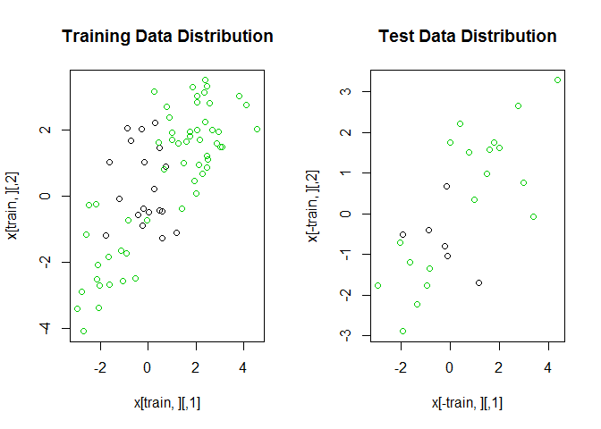
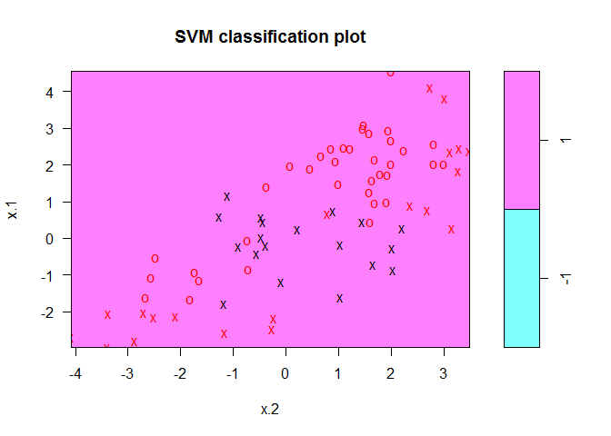
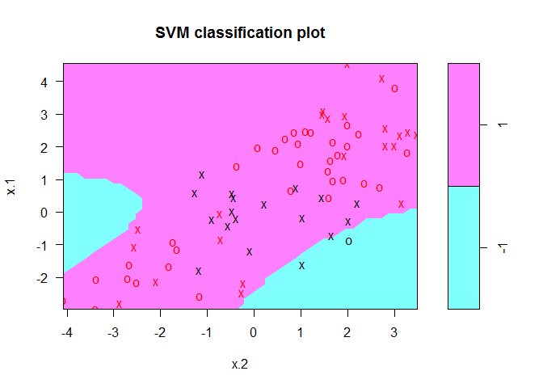
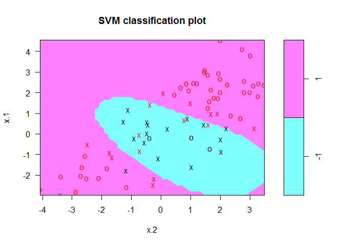

    knitr::opts_chunk$set(echo = TRUE)
    library(e1071)

### 4.a

    set.seed(1970)
    x = matrix(rnorm(2*100), ncol = 2)
    y = c(rep(1,75), rep(-1,25))
    x[1:50,] = x[1:50,]+2
    x[51:75,] = x[51:75,]-2
    dat = data.frame(x=x, y=as.factor(y))
    train = sample(100,75)
    par(mfcol = c(1,2))
    plot(x[train,], col = (y[train]+2), main = "Training Data Distribution")
    plot(x[-train,], col = (y[-train]+2), main = "Test Data Distribution")

    #Fitting a support vector classifier
    tune.out = tune(svm, y~., data = dat[train,], kernel = "linear",
                    ranges = list(cost = c(0.001, 0.01, 0.1, 1, 5, 10, 1000)))
    bestmod.svm.1 = tune.out$best.model

    #Fitting a SVM with a polynomial kernel
    tune.out = tune(svm, y~., data = dat[train,], kernel = "polynomial",
                    ranges = list(degree = c(2,3,4,5), cost = c(0.001,0.01, 0.1, 1),
                                  gamma = c(0.5, 1)))
    bestmod.svm.poly = tune.out$best.model

    #Fitting a SVM with a radial kernel
    tune.out = tune(svm, y~., data = dat[train,], kernel = "radial",
                    ranges = list(gamma = c(0.5, 1, 2, 3, 4), cost = c(0.001, 0.01, 0.1, 1, 5, 10, 1000)))
    bestmod.svm.radial = tune.out$best.model

    #Plotting the three fits
    print("Support Vector Classifier")

    ## [1] "Support Vector Classifier"

    plot(bestmod.svm.1, data = dat[train,])

    print("SVM with polynomial kernel")

    ## [1] "SVM with polynomial kernel"

    plot(bestmod.svm.poly, data = dat[train,])

    print("SVM with radial kernel")

    ## [1] "SVM with radial kernel"

    plot(bestmod.svm.radial, data = dat[train,])

    #Training error rates
    z = table(prediction = bestmod.svm.1$fitted, truth = dat$y[train])
    print(paste("Training Error Rate for Linear Kernel", "=", sum(z[row(z)!=col(z)])/sum(z)))

    ## [1] "Training Error Rate for Linear Kernel = 0.253333333333333"

    z = table(prediction = bestmod.svm.poly$fitted, truth = dat$y[train])
    print(paste("Training Error Rate for Polynomial Kernel", "=", sum(z[row(z)!=col(z)])/sum(z)))

    ## [1] "Training Error Rate for Polynomial Kernel = 0.226666666666667"

    z = table(prediction = bestmod.svm.radial$fitted, truth = dat$y[train])
    print(paste("Training Error Rate for Radial Kernel", "=", sum(z[row(z)!=col(z)])/sum(z)))

    ## [1] "Training Error Rate for Radial Kernel = 0.0933333333333333"

    #Test error rates
    z = table(prediction = predict(bestmod.svm.1, newdata = dat[-train,]), truth = dat$y[-train])
    print(paste("Test Error Rate for Linear Kernel", "=", sum(z[row(z)!=col(z)])/sum(z)))

    ## [1] "Test Error Rate for Linear Kernel = 0.24"

    z = table(prediction = predict(bestmod.svm.poly, newdata = dat[-train,]), truth = dat$y[-train])
    print(paste("Test Error Rate for Polynomial Kernel", "=", sum(z[row(z)!=col(z)])/sum(z)))

    ## [1] "Test Error Rate for Polynomial Kernel = 0.24"

    z = table(prediction = predict(bestmod.svm.radial, newdata = dat[-train,]), truth = dat$y[-train])
    print(paste("Test Error Rate for Radial Kernel", "=", sum(z[row(z)!=col(z)])/sum(z)))

    ## [1] "Test Error Rate for Radial Kernel = 0.12"

It is clear from the plots that the SVM with a radial kernel provides
the best fit on the training data where as the Support Vector Classifier
(SVC) fails entirely to separate the two classes. The SVM with a
polynomial kernel does a slightly better job than the SVC but only just.
This is refelcted in the training error rates reported as SVC - 25.33%,
SVM(poly) - 22.67% and SVM(radial) - 9.33%.

When it comes to the test error rates, the SVM(poly) does no better than
SVC. The test error rate of SVM(radial) are the best of the lot at 12%.
