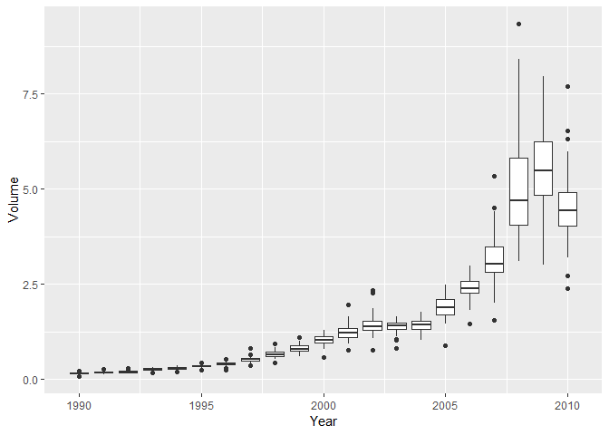

Setting up the environment

    library(ISLR)
    library(tidyverse)
    library(MASS) #for the LDA and QDA functions
    library(class) #for the KNN function
    data(Weekly)

10-a
====

    names(Weekly)

    ## [1] "Year"      "Lag1"      "Lag2"      "Lag3"      "Lag4"      "Lag5"     
    ## [7] "Volume"    "Today"     "Direction"

    dim(Weekly)

    ## [1] 1089    9

    summary(Weekly)

    ##       Year           Lag1               Lag2               Lag3         
    ##  Min.   :1990   Min.   :-18.1950   Min.   :-18.1950   Min.   :-18.1950  
    ##  1st Qu.:1995   1st Qu.: -1.1540   1st Qu.: -1.1540   1st Qu.: -1.1580  
    ##  Median :2000   Median :  0.2410   Median :  0.2410   Median :  0.2410  
    ##  Mean   :2000   Mean   :  0.1506   Mean   :  0.1511   Mean   :  0.1472  
    ##  3rd Qu.:2005   3rd Qu.:  1.4050   3rd Qu.:  1.4090   3rd Qu.:  1.4090  
    ##  Max.   :2010   Max.   : 12.0260   Max.   : 12.0260   Max.   : 12.0260  
    ##       Lag4               Lag5              Volume       
    ##  Min.   :-18.1950   Min.   :-18.1950   Min.   :0.08747  
    ##  1st Qu.: -1.1580   1st Qu.: -1.1660   1st Qu.:0.33202  
    ##  Median :  0.2380   Median :  0.2340   Median :1.00268  
    ##  Mean   :  0.1458   Mean   :  0.1399   Mean   :1.57462  
    ##  3rd Qu.:  1.4090   3rd Qu.:  1.4050   3rd Qu.:2.05373  
    ##  Max.   : 12.0260   Max.   : 12.0260   Max.   :9.32821  
    ##      Today          Direction 
    ##  Min.   :-18.1950   Down:484  
    ##  1st Qu.: -1.1540   Up  :605  
    ##  Median :  0.2410             
    ##  Mean   :  0.1499             
    ##  3rd Qu.:  1.4050             
    ##  Max.   : 12.0260

    cor(Weekly[,-9])

    ##               Year         Lag1        Lag2        Lag3         Lag4
    ## Year    1.00000000 -0.032289274 -0.03339001 -0.03000649 -0.031127923
    ## Lag1   -0.03228927  1.000000000 -0.07485305  0.05863568 -0.071273876
    ## Lag2   -0.03339001 -0.074853051  1.00000000 -0.07572091  0.058381535
    ## Lag3   -0.03000649  0.058635682 -0.07572091  1.00000000 -0.075395865
    ## Lag4   -0.03112792 -0.071273876  0.05838153 -0.07539587  1.000000000
    ## Lag5   -0.03051910 -0.008183096 -0.07249948  0.06065717 -0.075675027
    ## Volume  0.84194162 -0.064951313 -0.08551314 -0.06928771 -0.061074617
    ## Today  -0.03245989 -0.075031842  0.05916672 -0.07124364 -0.007825873
    ##                Lag5      Volume        Today
    ## Year   -0.030519101  0.84194162 -0.032459894
    ## Lag1   -0.008183096 -0.06495131 -0.075031842
    ## Lag2   -0.072499482 -0.08551314  0.059166717
    ## Lag3    0.060657175 -0.06928771 -0.071243639
    ## Lag4   -0.075675027 -0.06107462 -0.007825873
    ## Lag5    1.000000000 -0.05851741  0.011012698
    ## Volume -0.058517414  1.00000000 -0.033077783
    ## Today   0.011012698 -0.03307778  1.000000000

    Weekly %>% ggplot(aes(Year,Volume, group=Year))+geom_boxplot()

The only meaniful correlation is between Year and Volume. The boxplots
reveal that &lt;1&gt; the trading volume has increased over years, and
&lt;2&gt; so has the weekly variations in the volume in the given year.

10-b
====

    glm_fit = glm(Direction~.-Year-Today, data=Weekly, family=binomial)
    summary(glm_fit)

    ## 
    ## Call:
    ## glm(formula = Direction ~ . - Year - Today, family = binomial, 
    ##     data = Weekly)
    ## 
    ## Deviance Residuals: 
    ##     Min       1Q   Median       3Q      Max  
    ## -1.6949  -1.2565   0.9913   1.0849   1.4579  
    ## 
    ## Coefficients:
    ##             Estimate Std. Error z value Pr(>|z|)   
    ## (Intercept)  0.26686    0.08593   3.106   0.0019 **
    ## Lag1        -0.04127    0.02641  -1.563   0.1181   
    ## Lag2         0.05844    0.02686   2.175   0.0296 * 
    ## Lag3        -0.01606    0.02666  -0.602   0.5469   
    ## Lag4        -0.02779    0.02646  -1.050   0.2937   
    ## Lag5        -0.01447    0.02638  -0.549   0.5833   
    ## Volume      -0.02274    0.03690  -0.616   0.5377   
    ## ---
    ## Signif. codes:  0 '***' 0.001 '**' 0.01 '*' 0.05 '.' 0.1 ' ' 1
    ## 
    ## (Dispersion parameter for binomial family taken to be 1)
    ## 
    ##     Null deviance: 1496.2  on 1088  degrees of freedom
    ## Residual deviance: 1486.4  on 1082  degrees of freedom
    ## AIC: 1500.4
    ## 
    ## Number of Fisher Scoring iterations: 4

Lag2 is the only predictor that appears statistically significant

10-c
====

    glm_probs = predict(glm_fit, data=Weekly, type="response")
    glm_pred = rep("Down", 1089)
    glm_pred[glm_probs>0.5]="Up"
    table(glm_pred, Weekly$Direction)

    ##         
    ## glm_pred Down  Up
    ##     Down   54  48
    ##     Up    430 557

    mean(glm_pred==Weekly$Direction) # % times the prediction is right

    ## [1] 0.5610652

The accuracy of the logistic predictor is 56.1%. However, the market was
"Up" 55.5% (557+48)/1089 of all weeks. So a dumb predictor that predicts
"Up" everyday would be right 55.5% times. The logistic predictor built
is right 56.1% of the time. The improvement over a dumb predictor is
negligible.

The confusion matrix shows that the logistic predictor overwhelmingly
predicts "Up" (90% of the times) and hence does a great job of
accurately predicting the days when the market is indeed "Up" (90%), but
does a dismal job of predicting the "Down" days (11%).

10-d
====

    train_set = Weekly%>%filter(Year%in%1990:2008)
    test_set = Weekly%>%filter(Year%in%2009:2010)

    glm_fit_1 = glm(Direction~Lag2, data=train_set, family=binomial)
    glm_probs_1 = predict(glm_fit_1, newdata=test_set, type="response")
    glm_pred_1 = rep("Down", nrow(test_set))
    glm_pred_1[glm_probs_1>0.5] = "Up"

    table(Prediction=glm_pred_1, Actual=test_set$Direction)

    ##           Actual
    ## Prediction Down Up
    ##       Down    9  5
    ##       Up     34 56

    mean(glm_pred_1==test_set$Direction)

    ## [1] 0.625

10-e
====

    lda_fit = lda(Direction~Lag2, data=train_set)
    lda_pred = predict(lda_fit, newdata=test_set)
    table(Prediction=lda_pred$class, Actual=test_set$Direction)

    ##           Actual
    ## Prediction Down Up
    ##       Down    9  5
    ##       Up     34 56

    mean(lda_pred$class==test_set$Direction)

    ## [1] 0.625

10-f
====

    qda_fit = qda(Direction~Lag2, data=train_set)
    qda_pred = predict(qda_fit, newdata=test_set)
    table(Prediction=qda_pred$class, Actual=test_set$Direction)

    ##           Actual
    ## Prediction Down Up
    ##       Down    0  0
    ##       Up     43 61

    mean(qda_pred$class==test_set$Direction)

    ## [1] 0.5865385

10-g
====

    train_data = as.matrix(train_set$Lag2)
    test_data = as.matrix(test_set$Lag2)
    train_direction = train_set$Direction

    set.seed(1)
    knn_pred=knn(train_data,test_data,train_direction,k=1)

    table(Prediction=knn_pred, Actual=test_set$Direction)

    ##           Actual
    ## Prediction Down Up
    ##       Down   21 30
    ##       Up     22 31

    mean(knn_pred==test_set$Direction)

    ## [1] 0.5

10-h
====

The logistic regression and the LDA methods both provide an accurate
prediction 62.5% of the times and is the best of all the methods.
