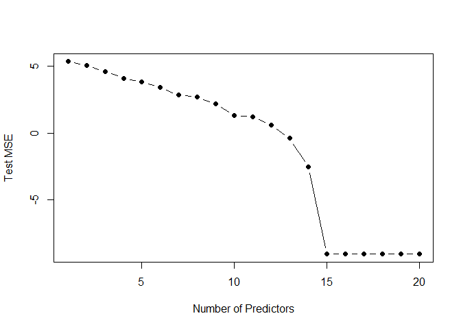
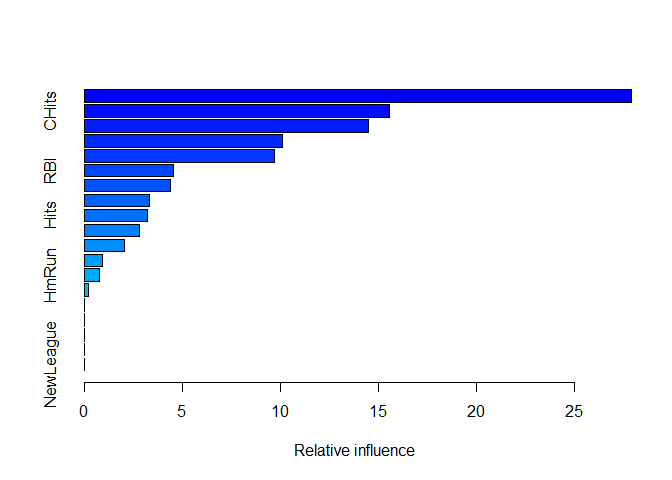

    knitr::opts_chunk$set(echo = TRUE)
    library(dplyr)
    library(gbm)
    library(ISLR)
    library(ggplot2)
    library(glmnet)
    library(randomForest)

    data(Hitters)

### 10.a

    na.ind = is.na(Hitters[,"Salary"])
    Hitters = Hitters[!na.ind,]
    Hitters = mutate(Hitters, Salary = log(Salary))

### 10.b

    train = 1:200

### 10.c

    lambda.range = seq(0.01,1,length.out = 25)
    error.pred.boost = rep(0, length(lambda.range))

    foo = function(x){
      boost.salary = gbm(Salary~., data = Hitters[train,], distribution = "gaussian",
                         shrinkage = x, n.trees = 1000)
      error.mean = boost.salary$train.error %>% mean()
    }

    set.seed(1970)
    error.pred.boost = sapply(lambda.range, foo)
    data.frame(lambda = lambda.range, MSE.error.train = error.pred.boost) %>% 
      ggplot(aes(lambda, MSE.error.train))+ geom_line(col = "Red")+ geom_point(col = "black")

### 10.d

    foo.1 = function(x){
      boost.salary = gbm(Salary~., data = Hitters[train,], distribution = "gaussian",
                         shrinkage = x, n.trees = 1000)
      yhat.boost = predict(boost.salary, newdata = Hitters[-train,], n.trees = 1000)
      error.mean = (yhat.boost - Hitters[-train,"Salary"])^2 %>% mean()
    }

    set.seed(1970)
    error.pred.boost = sapply(lambda.range, foo.1)

    data.frame(lambda = lambda.range, MSE.test.error = error.pred.boost) %>%
      ggplot(aes(lambda, MSE.test.error))+ geom_line(col = "Blue")+ geom_point(col = "Black")

### 10.e

    lm.salary = lm(Salary~., data = Hitters, subset = train)
    yhat.lm = predict(lm.salary, newdata = Hitters[-train,])
    error.pred.lm = (yhat.lm - Hitters[-train,"Salary"])^2 %>% mean()

    x.train = model.matrix(Salary~., data = Hitters[train,])
    x.test = model.matrix(Salary~., data = Hitters[-train,])
    lasso.salary = glmnet(x.train, Hitters$Salary[train], alpha = 1)
    yhat.lasso = predict.glmnet(lasso.salary, newx = x.test, type = "response")
    error.pred.lasso = (yhat.lasso-Hitters$Salary[-train])^2 %>% mean()
    data.frame(Boosted.Tree.Regression = min(error.pred.boost), Lasso.Regression = error.pred.lasso, OLS.Regression = error.pred.lm)

    ##   Boosted.Tree.Regression Lasso.Regression OLS.Regression
    ## 1               0.2586113        0.4755605      0.4917959

The Boosted Tree Regression significantly outperforms (~2x) both Lasso
Regression and OLS REgression.

### 10.f

    boosted.best.lambda = lambda.range[which.min(error.pred.boost)]
    boosted.salary = gbm(Salary~., data = Hitters, distribution = "gaussian", shrinkage = boosted.best.lambda)
    summary(boosted.salary)

    ##                 var    rel.inf
    ## CAtBat       CAtBat 27.9062196
    ## CHits         CHits 15.5659052
    ## CRuns         CRuns 14.4790238
    ## CRBI           CRBI 10.0959572
    ## CWalks       CWalks  9.7118788
    ## RBI             RBI  4.5309424
    ## Walks         Walks  4.3958832
    ## CHmRun       CHmRun  3.3267256
    ## Hits           Hits  3.2161211
    ## Years         Years  2.8308789
    ## PutOuts     PutOuts  2.0378263
    ## AtBat         AtBat  0.9323821
    ## HmRun         HmRun  0.7685746
    ## Division   Division  0.2016812
    ## Runs           Runs  0.0000000
    ## League       League  0.0000000
    ## Assists     Assists  0.0000000
    ## Errors       Errors  0.0000000
    ## NewLeague NewLeague  0.0000000

The most important predictor of Salary are CAtBat. The second most
important predictors are CHits and CRuns where as CRBI and CWalks also
have an impact on the value of Salary.

### 10.g

    set.seed(1970)
    bagged.salary = randomForest(Salary~., data = Hitters, subset = train, mtry = ncol(Hitters)-1)
    yhat.bagged = predict(bagged.salary, newdata = Hitters[-train,])
    error.pred.bagged = (yhat.bagged-Hitters$Salary[-train])^2 %>% mean()
    error.pred.bagged

    ## [1] 0.2319496

The test MSE for a bagged tree regression is 0.2319, slightly lower than
test MSE for boosted tree regression.
