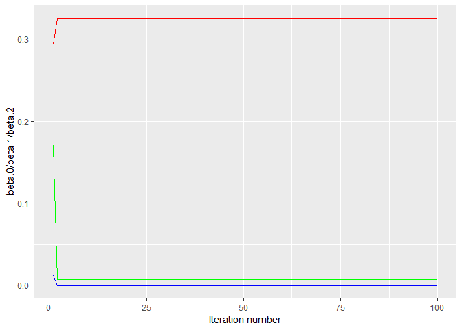

    knitr::opts_chunk$set(echo = TRUE)
    library(ISLR)
    library(dplyr)
    library(leaps)  #used for the regsubset()
    library(gam)    #for gam()
    library(ggplot2)

### Functions used in solutions below

### 11.a

    set.seed(1)
    y = rnorm(100)*3
    x.1 = rnorm(100)*5
    x.2 = rnorm(100)*7

### 11.b

    beta.1 = 5

### 11.c

    a = y-beta.1*x.1
    beta.2 = lm(a~x.2)$coef[2]

### 11.d

    a = y-beta.2*x.2
    beta.1 = lm(a~x.1)$coef[2]
    beta.0 = lm(a~x.1)$coef[1]

### 11.e

    beta.estimates = data.frame(beta.0 = c(beta.0, rep(0,99)), beta.1 = c(beta.1, rep(0,99)), beta.2 = c(beta.2, rep(0,99)))

    for (i in 2:100){
        a = y-beta.1*x.1
      beta.2 = lm(a~x.2)$coef[2]
      a = y-beta.2*x.2
      beta.1 = lm(a~x.1)$coef[2]
      beta.0 = lm(a~x.1)$coef[1]
      beta.estimates[i,] = c(beta.0 = beta.0, beta.1 = beta.1, beta.2 = beta.2)
    }

    beta.estimates

    ##        beta.0        beta.1      beta.2
    ## 1   0.2935176  1.222207e-02 0.170690512
    ## 2   0.3251546 -1.712034e-05 0.007242168
    ## 3   0.3252322 -4.715332e-05 0.006841093
    ## 4   0.3252324 -4.722701e-05 0.006840109
    ## 5   0.3252324 -4.722719e-05 0.006840106
    ## 6   0.3252324 -4.722719e-05 0.006840106
    ## 7   0.3252324 -4.722719e-05 0.006840106
    ## 8   0.3252324 -4.722719e-05 0.006840106
    ## 9   0.3252324 -4.722719e-05 0.006840106
    ## 10  0.3252324 -4.722719e-05 0.006840106
    ## 11  0.3252324 -4.722719e-05 0.006840106
    ## 12  0.3252324 -4.722719e-05 0.006840106
    ## 13  0.3252324 -4.722719e-05 0.006840106
    ## 14  0.3252324 -4.722719e-05 0.006840106
    ## 15  0.3252324 -4.722719e-05 0.006840106
    ## 16  0.3252324 -4.722719e-05 0.006840106
    ## 17  0.3252324 -4.722719e-05 0.006840106
    ## 18  0.3252324 -4.722719e-05 0.006840106
    ## 19  0.3252324 -4.722719e-05 0.006840106
    ## 20  0.3252324 -4.722719e-05 0.006840106
    ## 21  0.3252324 -4.722719e-05 0.006840106
    ## 22  0.3252324 -4.722719e-05 0.006840106
    ## 23  0.3252324 -4.722719e-05 0.006840106
    ## 24  0.3252324 -4.722719e-05 0.006840106
    ## 25  0.3252324 -4.722719e-05 0.006840106
    ## 26  0.3252324 -4.722719e-05 0.006840106
    ## 27  0.3252324 -4.722719e-05 0.006840106
    ## 28  0.3252324 -4.722719e-05 0.006840106
    ## 29  0.3252324 -4.722719e-05 0.006840106
    ## 30  0.3252324 -4.722719e-05 0.006840106
    ## 31  0.3252324 -4.722719e-05 0.006840106
    ## 32  0.3252324 -4.722719e-05 0.006840106
    ## 33  0.3252324 -4.722719e-05 0.006840106
    ## 34  0.3252324 -4.722719e-05 0.006840106
    ## 35  0.3252324 -4.722719e-05 0.006840106
    ## 36  0.3252324 -4.722719e-05 0.006840106
    ## 37  0.3252324 -4.722719e-05 0.006840106
    ## 38  0.3252324 -4.722719e-05 0.006840106
    ## 39  0.3252324 -4.722719e-05 0.006840106
    ## 40  0.3252324 -4.722719e-05 0.006840106
    ## 41  0.3252324 -4.722719e-05 0.006840106
    ## 42  0.3252324 -4.722719e-05 0.006840106
    ## 43  0.3252324 -4.722719e-05 0.006840106
    ## 44  0.3252324 -4.722719e-05 0.006840106
    ## 45  0.3252324 -4.722719e-05 0.006840106
    ## 46  0.3252324 -4.722719e-05 0.006840106
    ## 47  0.3252324 -4.722719e-05 0.006840106
    ## 48  0.3252324 -4.722719e-05 0.006840106
    ## 49  0.3252324 -4.722719e-05 0.006840106
    ## 50  0.3252324 -4.722719e-05 0.006840106
    ## 51  0.3252324 -4.722719e-05 0.006840106
    ## 52  0.3252324 -4.722719e-05 0.006840106
    ## 53  0.3252324 -4.722719e-05 0.006840106
    ## 54  0.3252324 -4.722719e-05 0.006840106
    ## 55  0.3252324 -4.722719e-05 0.006840106
    ## 56  0.3252324 -4.722719e-05 0.006840106
    ## 57  0.3252324 -4.722719e-05 0.006840106
    ## 58  0.3252324 -4.722719e-05 0.006840106
    ## 59  0.3252324 -4.722719e-05 0.006840106
    ## 60  0.3252324 -4.722719e-05 0.006840106
    ## 61  0.3252324 -4.722719e-05 0.006840106
    ## 62  0.3252324 -4.722719e-05 0.006840106
    ## 63  0.3252324 -4.722719e-05 0.006840106
    ## 64  0.3252324 -4.722719e-05 0.006840106
    ## 65  0.3252324 -4.722719e-05 0.006840106
    ## 66  0.3252324 -4.722719e-05 0.006840106
    ## 67  0.3252324 -4.722719e-05 0.006840106
    ## 68  0.3252324 -4.722719e-05 0.006840106
    ## 69  0.3252324 -4.722719e-05 0.006840106
    ## 70  0.3252324 -4.722719e-05 0.006840106
    ## 71  0.3252324 -4.722719e-05 0.006840106
    ## 72  0.3252324 -4.722719e-05 0.006840106
    ## 73  0.3252324 -4.722719e-05 0.006840106
    ## 74  0.3252324 -4.722719e-05 0.006840106
    ## 75  0.3252324 -4.722719e-05 0.006840106
    ## 76  0.3252324 -4.722719e-05 0.006840106
    ## 77  0.3252324 -4.722719e-05 0.006840106
    ## 78  0.3252324 -4.722719e-05 0.006840106
    ## 79  0.3252324 -4.722719e-05 0.006840106
    ## 80  0.3252324 -4.722719e-05 0.006840106
    ## 81  0.3252324 -4.722719e-05 0.006840106
    ## 82  0.3252324 -4.722719e-05 0.006840106
    ## 83  0.3252324 -4.722719e-05 0.006840106
    ## 84  0.3252324 -4.722719e-05 0.006840106
    ## 85  0.3252324 -4.722719e-05 0.006840106
    ## 86  0.3252324 -4.722719e-05 0.006840106
    ## 87  0.3252324 -4.722719e-05 0.006840106
    ## 88  0.3252324 -4.722719e-05 0.006840106
    ## 89  0.3252324 -4.722719e-05 0.006840106
    ## 90  0.3252324 -4.722719e-05 0.006840106
    ## 91  0.3252324 -4.722719e-05 0.006840106
    ## 92  0.3252324 -4.722719e-05 0.006840106
    ## 93  0.3252324 -4.722719e-05 0.006840106
    ## 94  0.3252324 -4.722719e-05 0.006840106
    ## 95  0.3252324 -4.722719e-05 0.006840106
    ## 96  0.3252324 -4.722719e-05 0.006840106
    ## 97  0.3252324 -4.722719e-05 0.006840106
    ## 98  0.3252324 -4.722719e-05 0.006840106
    ## 99  0.3252324 -4.722719e-05 0.006840106
    ## 100 0.3252324 -4.722719e-05 0.006840106

    beta.estimates %>% ggplot(aes(seq(1:100), beta.0))+ geom_line(col = "red")+ 
      geom_line(aes(seq(1:100), beta.1), col = "blue")+
      geom_line(aes(seq(1:100), beta.2), col = "green")+ xlab("Iteration number")+ ylab("beta.0/beta.1/beta.2")

### 11.f

    lm.fit = lm(y~x.1+x.2)
    beta.0.lm = coef(lm.fit)[1]
    beta.1.lm = coef(lm.fit)[2]
    beta.2.lm = coef(lm.fit)[3]

### 11.e

It took just 3 iterations for the backfitting to obtain a "good"
approximation to the multiple regression coefficients.
