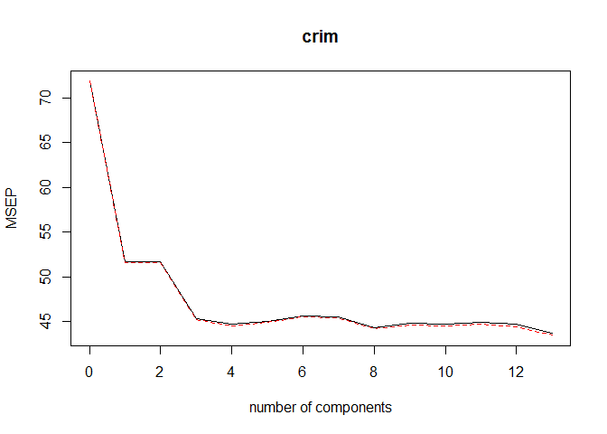
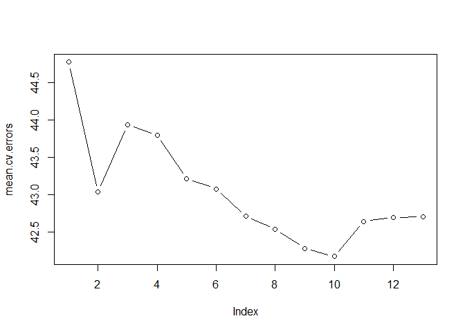

### Functions - Aggregating the various functions required for analysis

11.a.i PCR and LSE model
------------------------

    #Splitting data into a folds
    no.of.preds = ncol(Boston)-1
    no.of.folds = 5
    set.seed(27)
    fold = sample(1:no.of.folds, nrow(Boston), replace = TRUE)
    mse.pred.fold = rep(0, no.of.folds)

    #PCR MODEL
    #Determine the optimal value of M
    pcr.fit = pcr(crim~., data = Boston[fold!=1,], scale = TRUE, validation = "CV")
    validationplot(pcr.fit, val.type = "MSEP")

    #Based on the validation plot we proceed with further PCR investigation using M=8
    M=8

    mse.pred.pcr = mapply(mse.pred.pcr.folds, i=1:no.of.folds, m=M) %>% mean()

    #LSE MODEL
    mse.pred.lse = sapply(1:no.of.folds, mse.pred.lse.folds) %>% mean()

### 11.a.ii Ridge and Lasso models

    x.matrix = model.matrix(crim~., data = Boston)[,-1]
    y = Boston$crim

    #RIDGE MODEL
    mse.pred.ridge = mapply(mse.pred.glmnet.folds, i=1:no.of.folds, a=0) %>% mean()

    #LASSO MODEL
    mse.pred.lasso = mapply(mse.pred.glmnet.folds, i=1:no.of.folds, a=1) %>% mean()

### 11.a.iii Best subset selection model

    cv.errors = matrix(NA, no.of.folds, no.of.preds)

    for (i in 1:no.of.folds){
      best.fit.regsubset = regsubsets(crim~., data = Boston[fold!=i,], nvmax = no.of.preds)
      for (j in 1:no.of.preds){
        pred.regsubset = predict(best.fit.regsubset, newdata = Boston[fold==i,], id = j)
        cv.errors[i,j] = (pred.regsubset - Boston$crim[fold==i])^2 %>% mean()
      }
    }

    mean.cv.errors = apply(cv.errors,2,mean)
    plot(mean.cv.errors, type = "b")

    #BEST SUBSET SELECTION MODEL
    mse.pred.regsubset = min(mean.cv.errors)

### 11.a.iv Compare and contrast

    matrix(data = c("LSE", "Best Subset", "Ridge", "Lasso", "PCR", mse.pred.lse, mse.pred.regsubset, mse.pred.ridge, mse.pred.lasso, mse.pred.pcr), ncol = 2, dimnames = list(NULL, c("Model Type", "k-fold cross validated Test MSE")))

    ##      Model Type    k-fold cross validated Test MSE
    ## [1,] "LSE"         "153.044426612806"             
    ## [2,] "Best Subset" "42.1737589878456"             
    ## [3,] "Ridge"       "42.7271158119271"             
    ## [4,] "Lasso"       "42.3000410133883"             
    ## [5,] "PCR"         "43.996905009683"

All four models show significant improvement in the Test MSE over the
baseline least square model. However there is not much to choose between
these four models based on the Test MSE with the "Best Subset" model
performing the best.

Our recommendation is that we choose "Best Subset" and "Lasso" model for
further investigation as they have the potential to provide the most
inferencable model in so far as the predictors that have high impact on
the response variable.

### 11.b.i Investigating the Best Subset model

    #Investigation above reveals that the Best Subset model provides the lowest MSE for the set that includes 10 predictors. We now fit the Best Subset model to the entire data and then identify the 10 predictors that are inculded in the model together with their coefficients.

    reg.fit.full = regsubsets(crim~., data = Boston, nvmax = no.of.preds)
    reg.fit.coeff = coef(reg.fit.full, 10)
    reg.fit.coeff

    ##  (Intercept)           zn        indus          nox           rm 
    ##  16.38579874   0.04186311  -0.09330371 -10.62174498   0.44828268 
    ##          dis          rad      ptratio        black        lstat 
    ##  -0.99077268   0.53566370  -0.26956103  -0.00759461   0.13084608 
    ##         medv 
    ##  -0.19800062

### 11.b.ii Investigating the Lasso model

    #We will first establish the best lambda for the entire data and then use that lambda to identify the predictors that are included in the model together with their coefficients

    lasso.fit.full = glmnet(x.matrix, y, alpha = 1)
    best.lambda = (cv.glmnet(x.matrix, y, alpha = 1))$lambda.min
    lasso.fit.coef = predict(lasso.fit.full, type = "coefficients", s = best.lambda)[1:no.of.preds,]
    lasso.fit.coef

    ##   (Intercept)            zn         indus          chas           nox 
    ##  1.325949e+01  3.710115e-02 -7.429552e-02 -5.986112e-01 -7.539411e+00 
    ##            rm           age           dis           rad           tax 
    ##  2.651568e-01  0.000000e+00 -8.211252e-01  5.178546e-01 -2.017843e-06 
    ##       ptratio         black         lstat 
    ## -2.022884e-01 -7.547405e-03  1.265768e-01

The Lasso model includes 12 predictors where as the Best subset model
includes 10. Given that the Best Subset model outperforms Lasso in terms
of the Test MSE and includes lesser number of predictors (therefore more
interpretable), we recommend the use of the Best Subset model.
Furthermore, since the number of predictors is small the computational
overhead of the Best Subset model isn't a limitation.

### 11.c

The Best Subset model chosen excludes 3 predictors - "chas", "age",
"tax" - from the final model. It is probably because these 3 predictors
are subsumed in one or more of the other 10 predictors.
