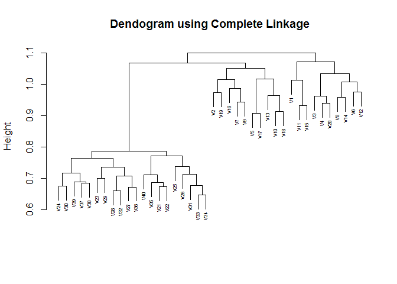

    knitr::opts_chunk$set(echo = TRUE)

### 11.a

    dat = read.csv("./Q11-Data_files/Ch10Ex11.csv", header = FALSE)

### 11.b

    set.seed(1970)

    #Here the number of observations is 40 (no. of samples) and number of features is 1000 (gene expressions)

    plot(hclust(as.dist(1-cor(dat)), method = "complete"), main = "Dendogram using Complete Linkage", 
         xlab = "", sub = "", cex = 0.5)

    plot(hclust(as.dist(1-cor(dat)), method = "average"), main = "Dendogram using Average Linkage", 
         xlab = "", sub = "", cex = 0.5)

    plot(hclust(as.dist(1-cor(dat)), method = "single"), main = "Dendogram using Single Linkage", 
         xlab = "", sub = "", cex = 0.5)

The results don't depend on the type of linkage used. The sample
separates into two "groups" at different heights depending on the
linkage type used. Technically, there are more than two groups formed:
most of the samples from the diseased group do indeed fall into one
group but most of the samples from the healthy group fall into a group
by itself.

### 11.b.contd

    print("Complete Linkage Groups")

    ## [1] "Complete Linkage Groups"

    cutree(hclust(as.dist(1-cor(dat)), method = "complete"), h = 0.85)

    ##  V1  V2  V3  V4  V5  V6  V7  V8  V9 V10 V11 V12 V13 V14 V15 V16 V17 V18 
    ##   1   2   3   4   5   6   7   8   9  10  11  12  13  14  15  16  17  18 
    ## V19 V20 V21 V22 V23 V24 V25 V26 V27 V28 V29 V30 V31 V32 V33 V34 V35 V36 
    ##  19  20  21  21  21  21  21  21  21  21  21  21  21  21  21  21  21  21 
    ## V37 V38 V39 V40 
    ##  21  21  21  21

    print("====")

    ## [1] "===="

    print("Average Linkage Groups")

    ## [1] "Average Linkage Groups"

    cutree(hclust(as.dist(1-cor(dat)), method = "average"), h = 0.85)

    ##  V1  V2  V3  V4  V5  V6  V7  V8  V9 V10 V11 V12 V13 V14 V15 V16 V17 V18 
    ##   1   2   3   4   5   6   7   8   9  10  11  12  13  14  15  16  17  18 
    ## V19 V20 V21 V22 V23 V24 V25 V26 V27 V28 V29 V30 V31 V32 V33 V34 V35 V36 
    ##  19  20  21  21  21  21  21  21  21  21  21  21  21  21  21  21  21  21 
    ## V37 V38 V39 V40 
    ##  21  21  21  21

    print("====")

    ## [1] "===="

    print("Single Linkage Groups")

    ## [1] "Single Linkage Groups"

    cutree(hclust(as.dist(1-cor(dat)), method = "single"), h = 0.85)

    ##  V1  V2  V3  V4  V5  V6  V7  V8  V9 V10 V11 V12 V13 V14 V15 V16 V17 V18 
    ##   1   2   3   4   5   6   7   8   9  10  11  12  13  14  15  16  17  18 
    ## V19 V20 V21 V22 V23 V24 V25 V26 V27 V28 V29 V30 V31 V32 V33 V34 V35 V36 
    ##  19  20  21  21  21  21  21  21  21  21  21  21  21  21  21  21  21  21 
    ## V37 V38 V39 V40 
    ##  21  21  21  21

### 11.c

TO determine which genes differ the most across the two groups, we will
rely on the distance between the genes (rather the distance between the
expressed value of the genes over the data set).

We use the fact that the first 20 samples are from the healthy group and
the second 20 samples are from the diseased group. For each of these
groups, for each of the 1000 genes we calculate the mean. This will give
us a 1000x2 matrix.

For this 1000x2 matrix, we find for each gene the square of the distance
between mean for the healthy group and the corresponding mean for the
diseased group. Arranging the genes in descending order of this squared
distance would give an ordered list of genes that differ the most
between the healthy group and diseased group.

    good.group.means = rowMeans(dat[,1:20]); bad.group.means = rowMeans(dat[,21:40])
    newdat = cbind(squared.dist = (good.group.means-bad.group.means)^2, gene.number = 1:1000)
    newdat = newdat[order(-newdat[,1]),]
    print("The top 10 genes that vary most across the healthy group and diseased group are")

    ## [1] "The top 10 genes that vary most across the healthy group and diseased group are"

    head(newdat[,2], 10)

    ##  [1] 600 584 549 540 502 568 582 565 562 554
