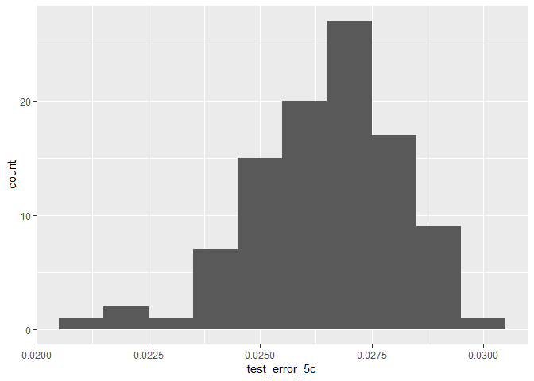

Setting up the environment

    library(tidyverse)
    library(boot)
    library(ISLR)

5.a
---

    data("Default")
    glm_fit_5a = glm(default~income+balance, data=Default, family=binomial)
    summary(glm_fit_5a)

    ## 
    ## Call:
    ## glm(formula = default ~ income + balance, family = binomial, 
    ##     data = Default)
    ## 
    ## Deviance Residuals: 
    ##     Min       1Q   Median       3Q      Max  
    ## -2.4725  -0.1444  -0.0574  -0.0211   3.7245  
    ## 
    ## Coefficients:
    ##               Estimate Std. Error z value Pr(>|z|)    
    ## (Intercept) -1.154e+01  4.348e-01 -26.545  < 2e-16 ***
    ## income       2.081e-05  4.985e-06   4.174 2.99e-05 ***
    ## balance      5.647e-03  2.274e-04  24.836  < 2e-16 ***
    ## ---
    ## Signif. codes:  0 '***' 0.001 '**' 0.01 '*' 0.05 '.' 0.1 ' ' 1
    ## 
    ## (Dispersion parameter for binomial family taken to be 1)
    ## 
    ##     Null deviance: 2920.6  on 9999  degrees of freedom
    ## Residual deviance: 1579.0  on 9997  degrees of freedom
    ## AIC: 1585
    ## 
    ## Number of Fisher Scoring iterations: 8

5.b
---

    validation_set_error = function(x){
      set.seed(x)
      
      training_data = sample(nrow(Default), round(nrow(Default)/2), replace=FALSE)
      training_set = Default[training_data,]
      validation_set = Default[-training_data,]
      
      glm_fit_5 = glm(default~income+balance, data=training_set, family=binomial)
      glm_probs_5 = predict(glm_fit_5, newdata=validation_set, type="response")
      glm_pred_5 = rep("No", nrow(validation_set))
      glm_pred_5[glm_probs_5>0.5] = "Yes"

      test_error = mean(glm_pred_5 != validation_set$default)
      return(test_error)
    }

    test_errror_5b = validation_set_error(1)

5.c
---

    test_error_5c = sapply(1:100, validation_set_error)
    dfx_5c = as.data.frame(test_error_5c)

    mean_error_5c = mean(dfx_5c$test_error_5c)

    dfx_5c %>% ggplot(aes(test_error_5c))+geom_histogram(binwidth=0.001)

Every random split of the data set into test and validation sets gives a
slightly differing value of the validation set error.

5.d
---

    validation_set_error_5d = function(x){
      set.seed(x)
      
      training_data = sample(nrow(Default), round(nrow(Default)/2), replace=FALSE)
      training_set = Default[training_data,]
      validation_set = Default[-training_data,]
      
      glm_fit_5d = glm(default~income+balance+student, data=training_set, family=binomial)
      glm_probs_5d = predict(glm_fit_5d, newdata=validation_set, type="response")
      glm_pred_5d = rep("No", nrow(validation_set))
      glm_pred_5d[glm_probs_5d>0.5] = "Yes"

      test_error = mean(glm_pred_5d != validation_set$default)
      return(test_error)
    }

    test_error_5d = sapply(1:100,validation_set_error_5d)

    dfx_5d = as.data.frame(test_error_5d)
    mean_error_5d = mean(dfx_5d$test_error_5d)

The inclusion of the dummy variable does not lead to a reduction in the
test error rate.
