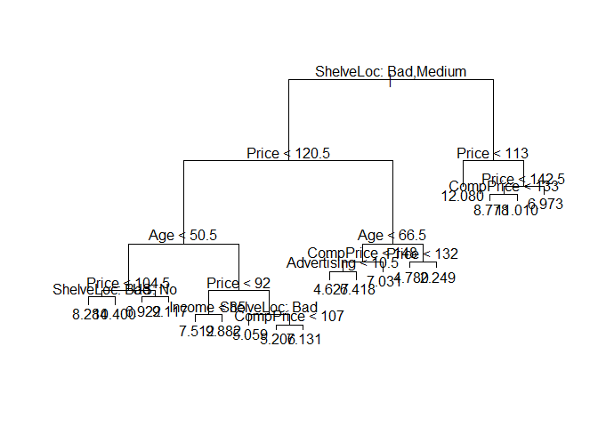

    knitr::opts_chunk$set(echo = TRUE)
    library(dplyr)
    library(tree)
    library(randomForest)
    library(ISLR)
    library(ggplot2)

    data(Carseats)

### 8.a

    set.seed(1)
    train = sample(1:nrow(Carseats), nrow(Carseats)/2, replace = FALSE)

### 8.b

    fit.tree = tree(Sales~., data = Carseats, subset = train)
    summary(fit.tree)

    ## 
    ## Regression tree:
    ## tree(formula = Sales ~ ., data = Carseats, subset = train)
    ## Variables actually used in tree construction:
    ## [1] "ShelveLoc"   "Price"       "Age"         "US"          "Income"     
    ## [6] "CompPrice"   "Advertising"
    ## Number of terminal nodes:  18 
    ## Residual mean deviance:  2.36 = 429.5 / 182 
    ## Distribution of residuals:
    ##    Min. 1st Qu.  Median    Mean 3rd Qu.    Max. 
    ## -4.2570 -1.0360  0.1024  0.0000  0.9301  3.9130

    plot(fit.tree)
    text(fit.tree, pretty = 0)

    yhat = predict(fit.tree, newdata = Carseats[-train,])
    test.pred.errors = (yhat - Carseats[-train, "Sales"])^2 %>% mean() %>% sqrt()
    test.pred.errors

    ## [1] 2.041186

The regression tree fitted on the training data has 18 terminal nodes.
However the regression uses only 7 of the 10 predictors for node
creation. The Shelve Location is the most important predictor of Sales.

For the test set the RMSE of the tree regression is 2.041186.

### 8.c

    cv.fit.tree = cv.tree(fit.tree, FUN = prune.tree)
    optimal.tree.size = cv.fit.tree$size[which.min(cv.fit.tree$dev)]
    optimal.tree.size

    ## [1] 10

    pruned.tree = prune.tree(fit.tree, best = optimal.tree.size)
    yhat = predict(pruned.tree, newdata = Carseats[-train,])
    test.pred.errors = (yhat - Carseats[-train, "Sales"])^2 %>% mean() %>% sqrt()
    test.pred.errors

    ## [1] 2.195383

Pruning the the regression tree using cross validation indicates that a
pruned tree with 10 terminal nodes delivers the lowest training error
rate. However using a pruned tree with only 10 terminal nodes slightly
increases the test set RMSE to 2.195 from 2.041 for an unpruned 18
terminal nodes regression tree.

### 8.d

    set.seed(1970)
    fit.bagging = randomForest(Sales~., data = Carseats, subset = train, mtry = ncol(Carseats)-1,
                               importance = TRUE)
    yhat = predict(fit.bagging, newdata = Carseats[-train,])

    test.pred.errors = (yhat - Carseats[-train, "Sales"])^2 %>% mean() %>% sqrt()
    test.pred.errors

    ## [1] 1.620824

    importance(fit.bagging, type = 1) %>% .[order(.[,1], decreasing = TRUE),]

    ##       Price   ShelveLoc         Age Advertising   CompPrice      Income 
    ##  58.0349351  47.0979651  22.0322208  18.0004990  14.1303893   6.3759848 
    ##          US   Education  Population       Urban 
    ##   5.5163511   1.3478544   0.2954509  -2.6246810

The bagging approach significantly reduces the test set RMSE to 1.605.
The most important predictors of Sales are Price and ShelveLoc.

### 8.e

    mtry.opt = seq(1, ncol(Carseats)-1, 1)
    test.pred.errors = rep(0, length(mtry.opt))

    foo = function(x){
            fit.rf = randomForest(Sales~., data = Carseats, subset = train, mtry = x,
                               importance = TRUE)
            yhat = predict(fit.rf, newdata = Carseats[-train,])

            test.pred.errors = (yhat - Carseats[-train, "Sales"])^2 %>% mean() %>% sqrt()
            return(test.pred.errors)
    }

    set.seed(1970)

    test.pred.errors = sapply(mtry.opt, foo)
    plot(test.pred.errors, type = "l", xlab = "No. of Predictors")

The random forest ensemble approach does not provide any improvement
over the bagging ensemble approach. As the graph above shows the test
RMSE for the forest ensemble is minimised at mtry = 10 which is
equivalent to creating a bagging ensemble.
