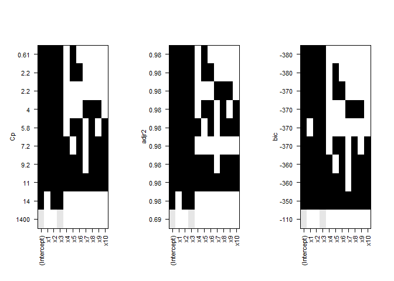
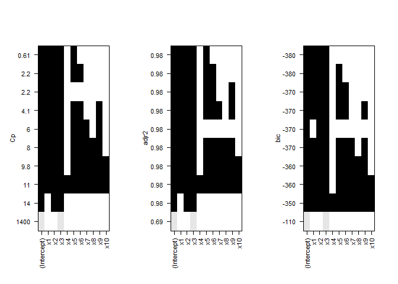
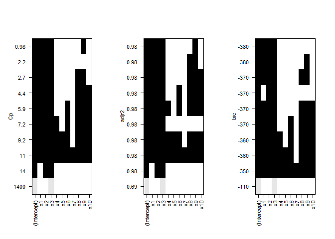
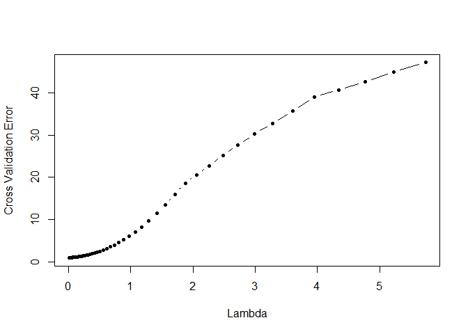
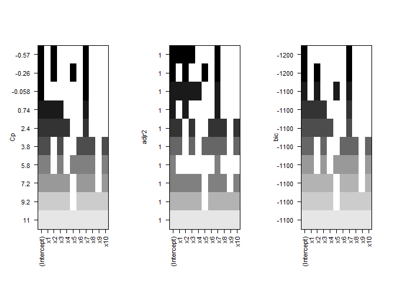

8.a
---

    set.seed(1)
    x = rnorm(100)
    noise = rnorm(100)

8.b
---

    beta0 = -11
    beta1 = 0.74
    beta2 = 3.45
    beta3 = -2.69

    #real reality
    y = beta0 + beta1*x + beta2*x^2 + beta3*x^3 + noise

    #assumed reality
    df = cbind.data.frame(y=y, x1=x, x2=x^2, x3=x^3, x4=x^4, x5=x^5, x6=x^6, x7=x^7, x8=x^8, x9=x^9, x10=x^10)

8.c.i Best Subset Selection
---------------------------

    regfit.full = regsubsets(y~., data = df, nvmax = 10)
    par(mfrow = c(1,3))
    plot(regfit.full, scale = "Cp")
    plot(regfit.full, scale = "adjr2")
    plot(regfit.full, scale = "bic")

Using either Cp or adjusted R-squared methods to estimate training error
recommends that the best subset selection includes 4 predictors
(x1,x2,x3 and x5), whereas the BIC method recommends that the best
subset selection includes 3 predictors (x1,x2,x3). Clearly the BIC
method, in this case, is better than the other 2 methods in determining
the right predictors to include in the best subset model.

### 8.c.ii Best Subset Selection: Estimating the coefficients

    coef(regfit.full, 4) #Coefficients of the 4 predictor best subsset

    ##  (Intercept)           x1           x2           x3           x5 
    ## -10.92799225   1.12745596   3.29575641  -3.13202574   0.08072292

    coef(regfit.full, 3) #Coefficients of the 3 predictor best subsset

    ## (Intercept)          x1          x2          x3 
    ## -10.9384928   0.7152803   3.3262090  -2.6723614

As expected the coefficients for the best subset with 3 predictors
closely matches the coefficients of the original model.

### 8.d.i Forward and Backward Stepwise Selection - Best subset selection

    regfit.full.fwd = regsubsets(y~., data = df, nvmax = 10, method = "forward")
    par(mfrow = c(1,3))
    plot(regfit.full.fwd, scale = "Cp")
    plot(regfit.full.fwd, scale = "adjr2")
    plot(regfit.full.fwd, scale = "bic")

    regfit.full.bwd = regsubsets(y~., data = df, nvmax = 10, method = "backward")
    par(mfrow = c(1,3))
    plot(regfit.full.bwd, scale = "Cp")
    plot(regfit.full.bwd, scale = "adjr2")
    plot(regfit.full.bwd, scale = "bic")

The graphs above show that similar to the best subset selection model,
both the forward and backward stepwise selection models when using
either Cp or adjusted R-squared methods to estimate training error
recommends that the best subset selection includes 4 predictors (for
forward stepwise x1,x2,x3 and x5 and for backward stepwise x1,x2,x3 and
x9), whereas the BIC method recommends that the best subset selection
includes 3 predictors (x1,x2,x3). Clearly the BIC method, in this case,
is better than the other 2 methods in determining the right predictors
to include in the best subset model.

### 8.d.ii Forward and Backward Stepwise Selection - Estimating the Coefficients

    coef(regfit.full.fwd, 4) #Coefficients of the 4 predictor best subsset - Forward Stepwise

    ##  (Intercept)           x1           x2           x3           x5 
    ## -10.92799225   1.12745596   3.29575641  -3.13202574   0.08072292

    coef(regfit.full.fwd, 3) #Coefficients of the 3 predictor best subsset - Forward Stepwise

    ## (Intercept)          x1          x2          x3 
    ## -10.9384928   0.7152803   3.3262090  -2.6723614

    coef(regfit.full.bwd, 4) #Coefficients of the 4 predictor best subsset - Backward Stepwise

    ##   (Intercept)            x1            x2            x3            x9 
    ## -10.920763638   0.971905828   3.283494180  -2.870444193   0.001290827

    coef(regfit.full.bwd, 3) #Coefficients of the 3 predictor best subsset - Backward Stepwise

    ## (Intercept)          x1          x2          x3 
    ## -10.9384928   0.7152803   3.3262090  -2.6723614

All three models provide the same predictors and same coefficients for
the 3 predictor subset and the coefficients are pretty close to
"reality".

### 8.e

    x.matrix = model.matrix(y~., data = df)[,-1]

    cv.lassofit.full = cv.glmnet(x.matrix, df$y, alpha = 1)
    best.lambda = cv.lassofit.full$lambda.min

    plot(cv.lassofit.full$lambda, cv.lassofit.full$cvm, xlab = "Lambda", ylab = "Cross Validation Error", pch = 20, type = "b")

    lassofit.full = glmnet(x.matrix, df$y, alpha = 1, lambda = best.lambda)
    coef.lassofit.full = coef(lassofit.full)[1:11,] #coerces the class to list for better display
    coef.lassofit.full

    ##   (Intercept)            x1            x2            x3            x4 
    ## -1.084606e+01  6.313868e-01  3.138249e+00 -2.651600e+00  1.559007e-02 
    ##            x5            x6            x7            x8            x9 
    ##  0.000000e+00  1.970645e-03  0.000000e+00  5.314853e-04  0.000000e+00 
    ##           x10 
    ##  2.891796e-05

The Lasso model is able to set the coefficients for 3 of 7 predictors
that do not influence the response variable (x5, x7, x9) to zero. The
remaining 4 have coefficients that tend to zero.

For the 3 predictors and the intercept value that influence the response
variable, the Lasso coefficient estimates are pretty close to the actual
model coefficients.

### 8.f

    beta7 = 5.26487
    y.8f = beta0 + beta7*x^7 + noise
    df.8f = data.frame(y.8f,x.matrix)

    regfit.full.8f = regsubsets(y.8f~., data = df.8f, nvmax = 10)
    par(mfrow = c(1,3))
    plot(regfit.full.8f, scale = "Cp")
    plot(regfit.full.8f, scale = "adjr2")
    plot(regfit.full.8f, scale = "bic")

    coef(regfit.full.8f,2) #Coefficients of the 2 predictor best subsset - Cp

    ## (Intercept)          x2          x7 
    ## -10.9295096  -0.1417084   5.2664252

    coef(regfit.full.8f,4) #Coefficients of the 4 predictor best subsset - Adj.R.Sq

    ## (Intercept)          x1          x2          x3          x7 
    ## -10.9237476   0.2914016  -0.1617671  -0.2526527   5.2740038

    coef(regfit.full.8f,1) #Coefficients of the 1 predictor best subsset - BIC

    ## (Intercept)          x7 
    ##   -11.04106     5.26564

    cv.lassofit.full.8f = cv.glmnet(x.matrix, y.8f, alpha = 1)
    best.lambda.8f = cv.lassofit.full.8f$lambda.min
    lassofit.full.8f = glmnet(x = x.matrix, y = df.8f$y.8f, alpha = 1, lambda = cv.lassofit.full.8f$lambda.min)

    coef(lassofit.full.8f)[1:11,] #Coefficients of the Lasso fit

    ##   (Intercept)            x1            x2            x3            x4 
    ## -10.327974452   0.000000000   0.000000000   0.000000000   0.000000000 
    ##            x5            x6            x7            x8            x9 
    ##   0.000000000   0.000000000   5.081764120   0.000000000   0.002648642 
    ##           x10 
    ##   0.000000000

In the case above (8.f), the best subset model produces differing
results based on the measure used to estimate test error. Using Cp as a
measure produces a model with 2 predictors(x2, x7), Adj-R.sq as a
measure produces a model with 4 variables (x1, x2, x3, x7) and BIC as a
measure produces a model with one variable (x7). Clearly the BIC is the
best option in this case.

For the model produced using Lasso method, the coefficeints for 8
predictor were driven to 0 but one predictor (x9) had a non zero
coefficeint albeit a very small one. The Lasso model results are
comparable to the one produced by Best subset method using BIC to
estimate test error.
