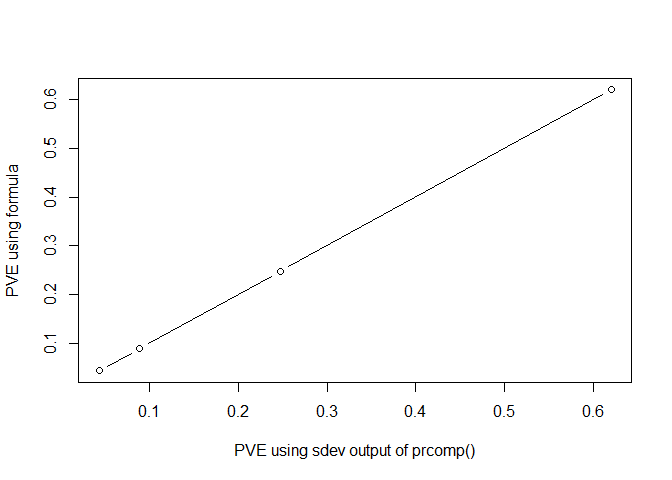

    knitr::opts_chunk$set(echo = TRUE)

### 8.a

    pr.out = prcomp(USArrests, scale. = TRUE)
    pve.sd = pr.out$sdev^2/sum(pr.out$sdev^2)

### 8.b

    USArrests.scaled = scale(USArrests)
    den.for = sum(USArrests.scaled^2)
    num.for = colSums(pr.out$x^2)
    pve.for = num.for/den.for

    plot(pve.sd, pve.for, type = "b", pch = 1, xlab = "PVE using sdev output of prcomp()", 
         ylab = "PVE using formula")

The graph shows that the two "methods" of calculating the PVE yield the
exact same results, as expected.
